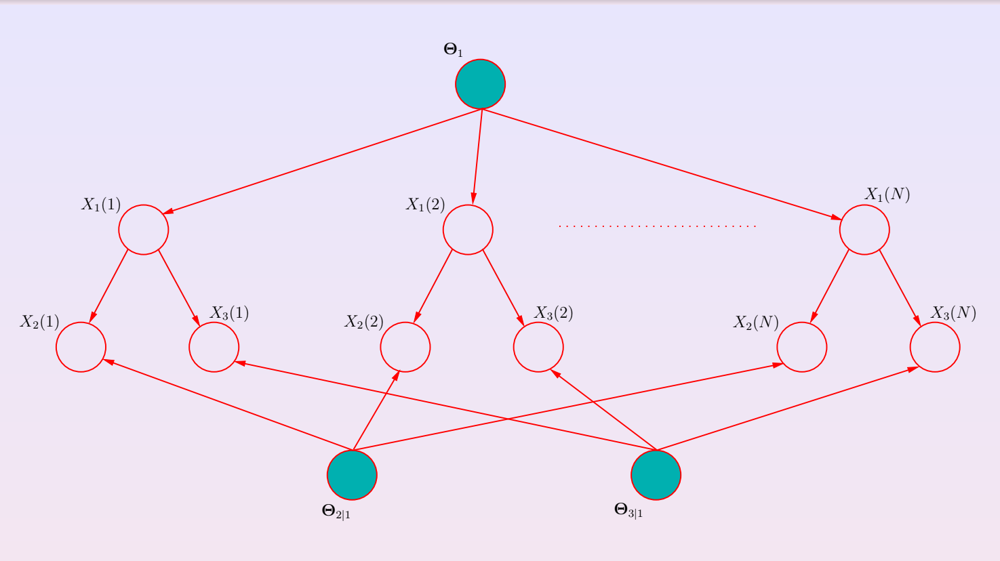

# Parameter estimation

Let's assume that we are given a model with already his structure. Together we are given also a dataset of examples $D=\{x(1),...,x(N)\}$ where each example $x(i)$ is a configuration for *all* (complete data) or *some* (incomplete data) variables in the model.

Now we need to estimate the parameters of the model from the data given. The simplest approach is to do Maximum Likelihood Estimation of the data given so
$$
\theta^{max} = \text{argmax}_\theta p(D|\theta) = \text{argmax}_\theta L(D,\theta)
$$

# Learning Bayesian Networks

||
|:--:|
|**Graph Example**|

Now we see with the structures already given how we do the learning on a BN structure using as example the graph above.

we have 
$$
P(D|\theta) = \prod_{i=1}^N p(x(i)|\theta)
$$

in which the examples are independent given $\theta$. This type of assumption is called *iid assumption* which stands for independant identically distributed. This means that the examples come frome the same distribution and they are independent from each other. This assumption allows us to replace the prior formula into the product of the probability of $x_(i)$ given the parameters for each example
$$
P(D|\theta) = \prod_{i=1}^N \prod_{j=1}^m p(x_j(i)|pa_j(i),\theta)
$$
This decomposition can be done only because the examples are independent and it's done throught the factorization for BN. The decompostion result in a probaibility of each node given it's parents. For this we split into the product of all nodes ($m$ are the nodes) inside our network ($x_j(i)$) given it's parents.

> **N.B.:** when we write $x_j(i)$ we mean that we arre refferring to
> - $i$ the i-th example
> - $j$ the j-th variable

For the sake of the explanation we introduce an example of a probability table for the bus arribing late depending on the weather. The modeling formalized will be $p(\text{Bus Late}|\text{Overlook})$

| Overlook | sunny | rainy | cloudy |
|----------|-------|-------|--------|
| **Bus Late** |       |       |        |
| **True**     | $\theta_{t\|s}$ |$\theta_{t\|r}$|$\theta_{t\|c}$|
| **False**    | $\theta_{f\|s}$ |$\theta_{f\|r}$|$\theta_{f\|c}$|

So this could be an example of one of the conditional probability distribution (**CPD**) in our network. Now we can think of $p(x_j(i)|pa_j(i),\theta)$ as the formalization of the table above so it happens that if we need to compute $p(x(j))$ given his parents what i care about are only the parameters of the CPD. With the prior formalization we are taking into account all possbile parameters since we are working with $\theta$. To work with only the parameters realated to our cpd we formalize like
$$
\prod_{i=1}^N \prod_{j=1}^m p(x_j(i)|pa_j(i),\theta_{X_j|\text{pa}_j})
$$

where $\theta_{X_j|\text{pa}_j}$ will be the arguments related to our distibution.

Now to find $\theta^*$ we need to maximize over the last formula so
$$
\theta^* =\text{argmax}_\theta \prod_{i=1}^N \prod_{j=1}^m p(x_j(i)|pa_j(i),\theta_{X_j|\text{pa}_j})
$$

***
Need explanation on the argmax
***

## Discrete Example 

We have a table like before made like

| Overlook | sunny | rainy | cloudy |
|----------|-------|-------|--------|
| **Bus Late** |       |       |        |
| **True**     | $\theta_{t\|s}$ |$\theta_{t\|r}$|$\theta_{t\|c}$|
| **False**    | $\theta_{f\|s}$ |$\theta_{f\|r}$|$\theta_{f\|c}$|

and now we take one set of examples made like

| Bus Late | Overlook |
|----------|----------|

Obviously the examples can have other features other than the one in the set we took but since we can separately maximize over each table we will take into account only the feature we are interested in. For this we can focus just on this slice of informations. The complete set will be:

| Bus Late | Overlook | $\theta$ value |
|----------|----------|----------|
|y|r| $\theta_{y\|r}$ |
|y|r| $\theta_{y\|r}$ |
|y|r| $\theta_{y\|r}$ |
|n|r| $\theta_{n\|r}$ |
|y|c| $\theta_{y\|c}$ |
|n|c| $\theta_{n\|c}$ |
|n|s| $\theta_{n\|s}$ |
|n|s| $\theta_{n\|s}$ |
|n|s| $\theta_{n\|s}$ |
|y|s| $\theta_{y\|s}$ |

> Author's Note: I added the theta value just to make clearer the later process

Now to calculate the probability we do 
$$
\prod_{i=1}^N p({BusLate}(i)|{Overlook}(i))
$$

so the computation goes like a moltiplication of the different $\theta$ where we will get:
$$
\theta_{y|r}^3 \theta_{n|r} \theta_{y|c} \theta_{n|c} \theta_{y|s} \theta_{n|s}^3
$$
and now we need to maximize this probability respect to the parameters and find the parameters which maximizes this probability. If we don't have constraints i just pick a theta and treat all of the rest as constants but we can't do that since if we get any $\theta$ the sum with his related $\theta$ must be one (e.g.if we take $\theta_{y|r}$ we need that the sum with $\theta_{n|r}$ to be one) so when we maximize we focus only on the related $\theta$. Since the sum must be one we know that
$$
\theta_{n|r} = 1 - \theta_{y|r}
$$

so we can write for the computation

$$
\theta_{y|r}^3(1 - \theta_{y|r})
$$

and with this state we can maximize the $\theta$ and we do a simple log-trasnformation to make values more manageable:

$$
3\log \theta_{y|r}\log (1 - \theta_{y|r})
$$

and now if we take the derivative and put it equal to zero (in order to maximize)

$$
\frac{\partial}{\partial \theta} 3\log \theta_{y|r}\log (1 - \theta_{y|r}) \Rightarrow 3 \frac{1}{\theta_{y|r}} + \frac{1}{1-\theta_{y|r}}(-1) = 0
$$

by doing all the steps we get that $\theta_{y|r}$ is equal to $\frac{3}{4}$ so even $\theta_{n|r}$ will be $\frac{1}{4}$. This is an ML estimation over a bernoulli distribution.
So for now maximizing a BN is just maximizing the single columns of the tables

## ML Estimation with complete data

Now we formalize the example in order to maximize the whole CPD. To do this first we replace the p with $\theta$ as we did before, so the local likelihood will become:

$$
L(\theta_{X|Pa},D) = \prod_{i=1}^N p(x(i)|pa(i), \theta_{X|Pa_j}) \Rightarrow \prod_{i=1}^N \theta_{x(i)|u(i)}
$$

and since we compute it for every possible result of the feature we formaliize it like

$$
\prod_{u\in Val(\bold{U})} [\prod_{x\in Val(\bold{X})} \theta_{x|u}^{N_{u,x}}]
$$
where:
- $\bold{U}$ are the possible value of the parent (looking at the example it would be overlook)
- $X$ are the possible values of the child (bus late)
- $\theta_{x|u}$ node given parent
- $N_{u,x}$ is the number of time we find that particular configuration (same thetas)

At the end we get that for the maximization that
$$
\theta_{x|u}^{max} = \frac{N_{u,x}}{\sum_X N_{u,x}}
$$

where it will be the counts of that configuration normalized per column since we are summing over $x$ so we take the whole column and this is the last part we did on the exercise.
The problem of this result is that with many features and not nenough data it could result in a no count of our event resulting in zero probability beacuse the graph doesnt recognize it since it doesnt have enough data
Another problem is that we don't have always all the data so we can't count unknown examples.

### example
 Suppose again we have still the table from before

| Overlook | cloudy | rainy | sunny |
|----------|-------|-------|--------|
| **Bus Late** |       |       |        |
| **True**     |3|1|0|
| **False**    |1|0|3|

we can see that we don't have many examples. So if we do the normal maximization we just take the count and normalize and this will result in

| Overlook | cloudy | rainy | sunny |
|----------|-------|-------|--------|
| **Bus Late** ||||
| **True**     |3/4|1|0|
| **False**    |1/4|0|1|

But now we have two problems. The first one is that if Overlook it's rainy than the table will always return that the bus will be late and the second one is that if it is sunny even in that case it will retur that the bus is always on point and this is happening because we don't have enough examples. Moreover the 1 from the sunny column is more confident than the one from rainy because it has more examples. So other than not having enough examples there isn't a method to know how much we are confident on that prevision. 

To deal with this instead of doing ML, we add a prior to the parameters and we do the maximum-a-posteriori. Applying the Bayes theorem we know that
$$
P(\theta|D) = \frac{P(D|\theta)P(\theta)}{P(D)}
$$
where we have:
- $P(D|\theta)$ is the likelihood
- $P(\theta)$ will be the prior 
- $P(\theta|D)$ will be the posterior

and since we are maximizing over $\theta$ we can treat P(D) as a constant so we don't need it and for the maximization we will focus only on $P(D|\theta)P(\theta)$.
The maximization depends on what kind of prior we put in the parameters. Suppose we take the likelihood as a binomial distribution when i combine it with my prior, basing on the distribution which can be the same or another regarding the likelihood, i obtain a **conjugation**.

> the distribution of the prior will be the same of the posterior

Since it's a binomial distribution we can write his formalization which is 
$$
P(D|\theta)= \theta^h(1-\theta)^t
$$

while for $\theta$ the prior is on a single parameter and the conjugate prior for a binomial distribution is called **beta** distribution which is made like
$$
P(\theta) = c*\theta^{\alpha_{h} -1}(1-\theta)^{\alpha_{t} -1}
$$

Now if we do the product we get
$$
P(D|\theta)P(\theta) = \theta^h(1-\theta)^t *C*\theta^{\alpha_{h-1}}(1-\theta)^{\alpha_{t-1}}
$$ (1)

$$
P(D|\theta)P(\theta) = \theta^{(h+\alpha^h -1)} (1-\theta)^{(t+\alpha_t -1)} *C
$$ (2)

Now if we maximize the last formula we get
$$
\theta = \frac{h+\alpha_h}{h+\alpha_h + t + \alpha_t}
$$

As we can see it's similar to the prior results obtained where we counted all the examples but with a twist. Other than counting the two possible results we  add the $\alpha$ of both cases. Now if we think about it the $\alpha$ (even h or t) do the same role of h and t. This is because in the final result we want to sum the **real value** of the examples ($h$) with the **virtual value** which belongs to the prior ($\alpha$)

## ML Estimatiom with incomplete data

As told before another problem with BN is the case in which we don't have all the data at our disposal. In this case we can't count the occurrences since some values are missing and the full Bayesian approach of integrating over missing variables is often intractable so we need to resort to alternative methods which is **Expectation Maximization**.

### E-Step
For this kind of approach we fill the missing data i infer them using the current parameters.
To do this in the **e-step** we need to know the number of entries of the table that we will call $N_{jik}$ (the entry in one table) where
- $i$ the node in which we are (table)
- $j$ the value for the parent node (the column)
- $k$ the value for the child node (row)

Now we can't compute the value of $N$ since data are missing, so i compute the expected value of this N "expected" according to the probability of x, the dataset and the currrent version of the parameters where
$$
E_{p(X|D,\theta)} [N_{ijk}] = \sum_{l=1}^n p(X_i(l)=x_k, Pa_i(l)=pa_j|X_l, \theta)
$$

in which we sum over all examples ($l$). The probability that node $i$ in example $l$ takes value $x_k$ and the parents of node $i$ in example $l$ take value j given $X_l$ which is what we already know respect to the parameters and the current version of the parameters. In short we just did a probabilistic inference (probability of some variables given other variables and parameters).

> If variable $X_i(l)$ and all $Pa_i(l)$ are fully observed for the example than the result will be 1 or 0. Otherwise we run Bayesian inference and we get a probabilistic value

At the end we will sum the 1 and 0 from the fully observed examples with the probabilistic values we got from the inference we ran in order to get the Expected count. Now with it we can use it as a count and we maximize.

### M-step

Now we want to maximize the parameters given the new dataset created with the expected counts $D_c$ where
$$
\theta^*=\text{argmax}_\theta p(D_c|\theta)
$$
which for each multinomial parameter evaluates to: 
$$
\theta_{ijk}^*=\displaystyle\frac{E_{p(\bold X|D,\theta)}[N_{ijk}]}{\displaystyle \sum_{k=1}^{r_i}E_{p(\bold X|D,\theta)}[N_{ijk}]}
$$

This formula just says to take the expected count from before and divide it by the expected count summing over all possible values $k$ which are the rows of the table. In practice what this formula does is just filling the aftermentioned table with the expected counts and then just normalizes it.

Obviously since the maximiziation step will find a new configuration we will need to reiterate this process until it converges. This will always result in a local optimum of the likelyhood where the $\theta$ won't change anymore.

> We can notice that the formula for the **m-step** is functionally the same as the ML so when we introduce a posterior probability we just sum to the expected counts the relative $\alpha$

## Learning the structure

Up until now we assumed that the structure was given and we just need to learn the parameters but there is even a lot of work in learning the structure itself. To learn them there are two main approaches:

- **constraint-based approach** in which we apply statisctical teston pairs of variables to check it they are directly related according to data. If they look like it we put a link and repeat for all classifiers
- **score-based approach** works like a search where we define a score for a structure that is basically how well the structure fits the data, and then we move around the structures adding, turning and removing edges in order to find the structure that maximizes the score

### Formulation for learning the structure (EXTRA)