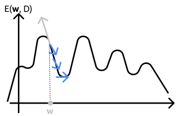

# Linear Discriminant Function

While for generative algorithms we infer knowledge from the modelled data distibution we have, with **dicriminative learning** we focus directly on modelling the discriminant function. For example in classification woth this method we directly model the decision boundary.

## Formalization
Now we want to learn an $f(x)$ which maps $x$ in $y$ ($f:x\rightarrow y$). So we formalize the linear function like
$$
f(x) = w^Tx + w_0
$$
The discriminant function is a linear combination of example features in which $w_0$ is the so called *bias* or *threshold* and it is the simplest possibile discriminant function. The problem since it's linear we can't use it for complex problems but it's the most easy one to apply and once applied we can always expect the results so it's less prone to *overfitting*.

# Linear Binary Classifier

Now a linear **binary** classifier it's a linear predictor which need to distinguish between two classes. So in this case we can get the normal linear discriminant function and get his sign so if the function will be positive the label will be 1 otherwise -1

$$
f(x) = sign(w^Tx + w_0)
$$

if $f(x)$ is equal to 0 than we are on the **hyperplane** which will be the decision boundary. 
Moreover the weight vector $w$ is orthogonal ($\perp$) to the decision hyperplane. We can formalize it with a bit of algebra where we take two points on the hyperplane so their function is equal to zero as we do below where
$$
\forall x,x' : f(x) = f(x') = 0
$$
now if we replace them with their formalization we get that
$$
w^Tx + \cancel{w_0} - w^Tx' - \cancel{w_0} = 0 \Rightarrow w^T(x-x') = 0
$$

which means that $w$ is orthogonal respect to $(x-x')$

## Functional Margin

The functional margin can be seen as the confidence we have on a particular prediction. It's value is the value of $f(x)$ before applying the sign. The larger the value the more confident we are on that particular prediction. 

## Geometric margin

We call the geometric margin the distance between $x$ and the hyperplane. We obtain it from the functional margin by doing
$$
r^x = \frac{f(x)}{||w||}
$$
where $r^x$ will be the margin

> we can see that the geometric margin is just the functional margin normalized

check demonstration on ot 27:17

# Biological Motivation

shish

# Perceptron

If we want to formalize a neuron we do it like a normal linear function made as
$$
f(x) = sign(w^Tx + w_0)
$$

As we can see from the image below we have a set of inputs to the neuron from $x_1$ to $x_m$ where every input will be multiplied for his weight(which can be positive or negative). Later all this weighted inputs will be summed up together with $w_0$ and if the sum will be higher than the threshold we will predict 1 otherwise -1 (u need to surpass the threshold in order to activate it so that's why is called activation function)

> add perceptron img

now if we take the function written before we can represent a series of primitive logical operations like AND, NAND or NOT since the results can be separated by a single line. In cases like the XOR in which we cannot learn the linear function itself since it doesn't exist, we can represent those cases by a network of two levels of perceptron.

$$
\newcommand{\x}[2]{$x_#2$}
\newcommand{\y}[2]{$y_#2$}
\newcommand{\z}[2]{$z_#2$}
\begin{neuralnetwork}
  \inputlayer[count=2, bias=false,text=\x]{}
  \hiddenlayer[count=2, bias= false,text=\y]{} \linklayers
  \outputlayer[count=1,text=\z]{} \linklayers
\end{neuralnetwork}
$$

For example in the case of the XOR we can decompose it in 
$$
 x_1 \oplus x_2 = (x_1 \wedge \overline{x_2}) \vee (\overline{x_1} \wedge x_2)
$$ 
where the node $y_1$ will take care of learning $(x_1 \wedge \overline{x_2})$, $y_2$ will learn $(\overline{x_1} \wedge x_2)$  and the node $z_1$ will learn the conjuction of the two.

## Learning linear models

We already know the formula for the perceptron which is 
$$
f(x) = sign(w^Tx)
$$

but we need first a way to incorporate bias in our formula. To do this we use **augmented vectors** in which we add for both the feature vectors $\hat{x}$ and the weight vector $\hat{w}$ so they are made like
$$
\hat{w} = \begin{bmatrix} w_0\\ \mathbf{w} \end{bmatrix} \hat{x} = \begin{bmatrix} 1\\ \mathbf{x} \end{bmatrix}
$$

Now we need to find a function in order to maximize our parameters. One reasonable way to do it is measuring the estimate of the predictor given the ground truth and check whether it's correct or not like
$$
E(\mathbf w, D) = \sum_{(\mathbf x, y)\in D}l(y, f(\mathbf x))
$$

where:
- $l(y, f(\mathbf x)$ measures the loss incurred on measuring $f(x)$ opposite to $y$
- $D$ is our training set
- $l$ is the loss function
- $y$ the ground truth
- $f(\mathbf{x})$ the prediction given

The problem in minimizing the error of the training set is that we risk that our model **overfits** the data which will result in a problem when we generalize it since other than the distribution the predictor learned even the noise from a particular set.

### Gradient Descent

||
|:--:|
|**Gradient Descent**|

Let's take an error function $E(\mathbf w, D)$ with a single parameter w. Now we want to minimize this error. To do this we take the gradient of the error respect to W and we set it to zero which will result like
$$
{\underset{\mathbf{w}}{\nabla E}} (\mathbf w: D) = 0
$$

if the gradient reaches 0 it means we are either in a minimum or a maximum of the function. What we want is to reiterate this process until we reach a value approximable to zero.
To do this first we set our $\mathbf w$. Now if we take the derivative (which is represented by the gray arrow) we can see that the result will be an upward arrow due to the gradient which follows the increase of a function so since we want to minimize the error (**NOT** maximizing it) we'll take the opposite direction. Now to find the new $\mathbf w$ we do
$$
\mathbf w = \mathbf w- \eta {\underset {\mathbf{w}} {\nabla E} }
$$
We can notice that we introduced the new term $\eta$ which refers to the **learning rate** which tells us how much to go in that particular direction given by the gradient.

> Values too large for $\eta$ cam result in a continuous oscillation around the minima without reaching it. Values to small from the other part will result in a slow learning or we could get stuck in a local minima. There are methods to set $\eta$ on the fly 

### Parameter Learning

Now that we have a general understanding of the gradient descent we need to pick an error function to learn the parameter of our model. If we value accuracy we could say that a reasonable error function could be the **missclassification loss** ($1-f(x)$) which is a very sensible measure of the classifier error but it's not good for gradient descent since in the function of the missclassification the only derivative can be zero or null.

Opposite to accuracy we can go for confidence where we use the **confidence loss**, the higher the confidence in the wrong prediction, the higher the result in the function: $\displaystyle E(\mathbf w, D) = \sum_{(\mathbf x, y)\in D_e} -yf(\mathbf x)$. It's important to notice that we are summing a subset of the training data. Infact $D_e$ is just a subset of the current training set in which we took the examples where our classifier was taking wrong predictions. This measure is made like $\displaystyle yf(x) \leq 0$.

Now that we have an error function we can think about the gradient of the function. Applying the gradient we get that
$$
\begin{aligned}
\begin{split}
  \nabla E(\mathbf w, D) 
  &= \nabla \sum_{(\mathbf X, y)\in D_E} -yf(x) 
  \\
  &= \nabla \sum_{(\mathbf X, y)\in D_E} -y(\mathbf{w}^T\mathbf{x})
  \\
  &= \nabla \sum_{(\mathbf X, y)\in D_E} -y\mathbf{x} 
  \\
\end{split}
\end{aligned}
$$

so the update of $\mathbf w$ at each iteration is $\displaystyle-\eta \nabla E(\mathbf w, D) = \eta \sum_{(\mathbf x, y)\in D_E} -y\mathbf x$ until we reach a zero gradient.

Still a problem rises. If we take a closer look we see that during fradient descent we iterate over all the examples which will result in slow computations in cases where the dataset is really wide. This type of learning is called **batch learning** because everytime we compute the error on the batch of examples we are given

### Stochastic training rule

An alternative is stochastic gradient descent. With this particular approach instead of computing the gradient of the error on all the batch, we make it stochastic by computing it only on a subset of the examples.
First we initialize the weights randomly and than we iterate until all examples are correctly calssifies. When we meet a wrongly classified sample we immediately update the $\mathbf w$: $\mathbf w \leftarrow \mathbf w + \eta y \mathbf x$

## Perceptron Regression

Let $X$ be a matrix, in which we collect the training examples where $X \in \mathbb R^n \times \mathbb R^d$ with $n$ rows, one for each sample ($n = |D|$), and $d$ columns, one for each feature ($d=|\mathbf x|$).
Let $\mathbf y\in\mathbb R^n$ be the output training vector where for every $y_i$ is output for $x_i$.

Ath this point we can write linear regression as a set of linear equations where:
$$
X\mathbf{w} = \mathbf{y}
$$
in order to get the solution
$$
\mathbf{w} = \mathbf{y}X^{-1}
$$
The problem is that to reach to this particular solution we need $X$ to be invertible which is not always our case. Usually the matrix $X$ is a rectangular matrix with more rows than columns so we have more equations than unknowns sol  no exact solution tipically exists (**overdetermined**). 

> Still this is not a big problem since we don't want to optimize a particular problem but to learn it.

### Mean Squared Error

To address this problem we define an error function and we minimize it. The most common error function for regression is the **mean squared error** where the squared error is the difference between $y$ and $f(\mathbf x)$ where
$$
E(\mathbf w, D) = \sum_{(\mathbf x, y)\in D}(y - f(\mathbf x))^2 = (\mathbf y - X \mathbf w)^T(\mathbf y - X \mathbf w)
$$

For this formula it exists a closed form solution and can be used as a classification loss even if it's not the best. The solution goes like:

$$
\begin{aligned}
\begin{split}
\nabla E (\mathbf{w};D) 
&= \nabla (\mathbf{y} - X\mathbf{w})^T(\mathbf{y}-X\mathbf{w})
\\
&= 2(y - X\mathbf{w})^T(-X) = 0
\\
&= -2\mathbf{y}^TX + 2\mathbf{w}^T X^T X = 0
\\
\mathbf{w}^T X^T X &= \mathbf{y}^T X
\\
X^TX\mathbf{w} &= X^T\mathbf{y}
\\
\mathbf{w} &= (X^T X)^{-1} X^T \mathbf{y}
\\
\end{split}
\end{aligned}
$$
where in particular:
- At the second step if we zero we get the third term
- Now at the 4th step we get that $w$ is tranposed but we need the non transposed value so we transpose all the term the holds $w$ where $\displaystyle (\mathbf{w}^TX^TX)$ becomes $\displaystyle (\mathbf{w}^T)^T (X^TX)^T$  where $\mathbf{w}$ will return to the normal value while the second term will become $(X^T X)$

> Check cheat sheet for further explanation on the solution

Now we can compare the initial formula we got for regression with the one we just found.
$$
\mathbf{w} = \mathbf{y}X^{-1} ,||| \mathbf{w} = (X^T X)^{-1} X^T \mathbf{y}
$$

We can see that the $X^{-1}$ has been replaced for $(X^T X)^{-1} X^T$ which is called pseudoinverse or *left-inverse*. What happens is while the inverse of X doesn't necessarily exist the left inverse always exist since $X^TX$ will always give a squared matrix (still the matrix needs to be invertible). The matrix provided $(X^T X) \in \mathbb{R}^{d\times d}$ dimensions is full rank which means that all the features are independent (in case just remove the redundant ones).
Note that in the unlikely event that X is invertible this method will return exactly the solution given by the simpler formula.

Still we need to invert the matrix which could become very expensive since we need to invert every feature. For this particular reason we can apply gradient descent and applying it just means we compute the gradient like
$$
\nabla (\mathbf{y} - X\mathbf{w})^T(\mathbf{y}-X\mathbf{w}) \Rightarrow 2(y - X\mathbf{w})^T(-X) = 0
$$

and than we iterate over it

## Multiclass Classification

Last type of linear function is **multiclass classification**. In these cases we got more than one class to distinguish so we can't separate them with only one hyperplane. So to counter we can decompose the problem in multiple sub-problem resolvable with a linear classifier and than we combine the different results.

### One vs All :gun:

Is one way to approach the problem cited before. With this approach we learn a binary classifier for each class:

- in case of a positive example it will belong to the class we are testing;
- in case of a negative one it will be an example of all the other classes.

So when we will try a new training set we'll pass it to our classifier and than the classifier will predict the class based on the highest confidence it has. Doing this will result in a decision boundary which is composed by pieces of hyperplanes. If we take two different classes $i$ and $j$ where their decision boundary is $f_i(x) = f_j(x)$ we get that

$$
\begin{aligned}
\begin{split}
\mathbf{w}_i^T \mathbf{x} &= \mathbf{w}_j^T \mathbf{x}
\\
(\mathbf{w}_i - \mathbf{w}_j)^T \mathbf{x} &= 0
\\
\end{split}
\end{aligned}
$$

> PRedicting a new example will be just maximizing the functional margin

### All Pairs

With this method we train a binary classifier for each pair of classes where:

- positive examples will be from one class
- negative examples from the other

To see which example the class will belong to we will pick the class with the more number of "duels" won

### One-vs-all vs All-pairs

In _one vs all_ you have to train $m$ classifiers, each with all examples. In _all pairs_ you have to train $\displaystyle\frac{m(m-1)}{2}$ classifiers (order of $m^2$ classifiers), but each one only with the examples of the two classes we are training on.

If the complexity of the training procedure is higher than quadratic in the number of examples, _all pairs_ is faster.

## Generative Linear Classifier

But what about generative model for classification? A number of generative models are linear classifiers.

For example **Gaussian classifier** produces a log linear classifier only if the covariance shared between the classes is the same ($\sum_i = \sum_j$)

Another linear classifier is **Naive Bayes classifier** in which we have the probability of the features given the class times the class itself and if we compute it prduces another linear log classifier.

$$
\begin{aligned}
\begin{split}
f_i(\mathbb x) &= P(\bold x|y_i)P(y_i)
\\
&=\prod_{j=1}^{|\bold x|}\prod^{K}_{k=1} \theta^{z_k}_{ky_i}(x[j])\frac{|D_i|}{|D|} 
\\
&= \prod^{K}_{k=1} \theta^{N_{k\bold x}}_{ky_i}\frac{|D_i|}{|D|}
\end{split}
\end{aligned}
$$

where in particular:

- when we test features we check for $\displaystyle\prod^K_{k=1} P(x_k|y_i)P(y_i)$. Basically what we did instead of having the probability of the entire set of class we decompose it into the probability of single feature given the class
- When i take the product over the $K$ features $P(x_i|y_i)$ will become $\displaystyle\theta^{N_{k\bold x}}_{ky_i}$ where $N_{k\mathbf{X}}$ is the number of feature $k$ appears in $\mathbf{x}$
- $\displaystyle \frac{|D_i|}{|D|}$ is $P(y_i)$

Now if we take the log of the function we get  
$$
\log f_i(\bold x) = \underbrace{\sum^{K}_{k=1}N_{k\bold x}\log{\theta_{ky_i}}}_{\bold w^T \bold x'}+\underbrace{\log(\frac{|D_i|}{|D|})}_{w_o}
$$

where we can see that the product becomes a sum over the features of $N_{k\mathbf{X}}$ times $\log{\theta_{ky_i}}$ plus the second part. Now with this there will be a few consequences:

- we call $\mathbf{x'}$ (it's a postprocessing of x) $N_1\mathbf{x}$ up to $N_k\mathbf{x}$ the frequencies of each of the features ($\bold x' = [N_{1\bold x}...N_{K\bold x}]^T$)
- we call $\mathbf{w}$ all the $\log \theta$ as the vector of weights ($\bold w = [\log{\theta_{1y_i}}...\log{\theta_{Ky_i}}]^T$)
  - $w_0$ is the bias (since it doesn’t contain any $\bold x$)