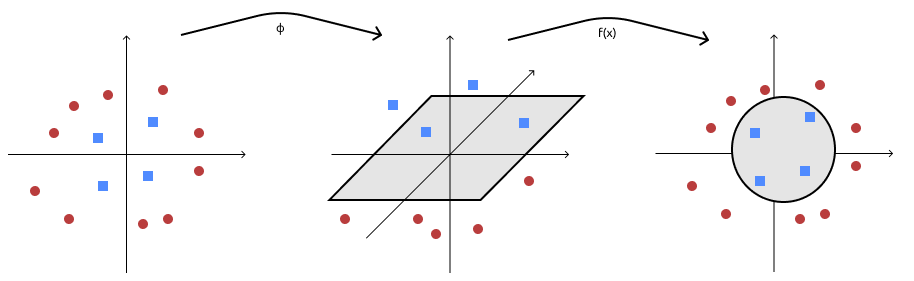
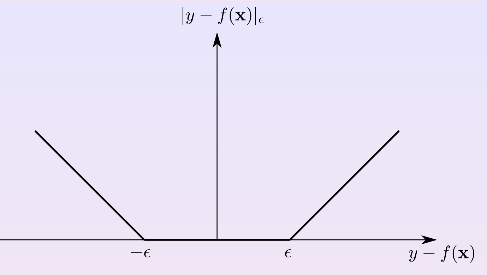

# Non Linear SVM
So far we've seen that hard margin assumes that training examples are linearly separable and separates them with the larger margin while soft margin allows for exceptions.

Now we if we have a non linear problem soft margin svm can't help us so we will need a non-linear separator but we'd want to mantain all the advantages of the linear separators. The solution to this is to apply linear separation not in the input space but rather on the feature space, tipically higher dimensional feature space

## Feature Map

To do this we need a **feature map** $\phi$ which is a function that maps an example $x$ to a higher dimensional space $H$. Basically what happens is that each example $x$ is replaced with their feature mapping $(\phi(x)$) and in this way we increse the expressive power of the representations since we introduced features which are a combination oh the ones in input. Now we should be able to apply linear separable problem

### Polynomial mapping

This type of function maps input vector to their **polynomial**, either:

- of a certain degree $d$ (homogeneous mapping) $\to \phi\begin{pmatrix}x_1\\x_2\end{pmatrix} = \begin{pmatrix}x_1^2\\ x_1x_2\\ x_2^2\end{pmatrix}$
- up to a certain degree (inhomogeneous mapping). $\to \phi\begin{pmatrix}x_1\\x_2\end{pmatrix} =  \begin{pmatrix}x_1^2 \\x_1\\ x_1x_2\\ x_2\\ x_2^2\end{pmatrix}$ 

||
|:--:|
|**Feature Mapping**|

As we can see from the image above on the first representation there isn't a linear separator capable of dividing the dataset linearly. But, if we apply our $\phi$ we get to the second representation and in that rapresentation we have an hyperplane which separates them.

## Linear Separation in feature space

What happens in the input space applying the mapping to the SVM is that we just replace $\mathbf{x}$ with $\phi(\mathbf{x})$ in order to get
$$
f(\mathbf x) = \mathbf{w}^T\phi(\mathbf{x}) + w_0
$$

Now the part we wnat to leverage is this. For every linear separation (i.e. hyperplane) we have in the feature space it corresponds to a non-linear separation in the original input space as we can see from the image above on the third representation. 

For example suppose we have the weights like $w = \langle w_1,w_2,w_3,w_0\rangle$ and a mapping we'd get in the original space:
$$
f \begin{pmatrix}
    x_1
    \\
    x_2
\end{pmatrix}
= \text{sgn}(w_1x_1^2 +w_2x_1x_2+w_3x_2^2+w_0)
$$

## Support Vector Regression

During regression with support vector machines we want to retain combination of regularization and data fitting. This will be achieved using a **sparsifying loss** to have few support vectors.

> Regularization $\Rightarrow$ *smoothness* of the learned function

### $\epsilon$ insensitive loss

In classification with SVM as a loss we used the *hinge loss*. Now we want to use something similar to do the regression part but we are more keen towards a loss function made like the MSE ($(y-f(x))^2$) since it's more feasible for regression. The problem with MSE is that either u have the same $y$ value or you pay something unlike the hinge loss where after a threshold you pay nothing.

So for SVM Regression we use something closer the hinge loss in which 

||
|:--:|
|**Feature Mapping**|

$$
l(f(\mathbf{x}),y) = |y - f(\mathbf{x})|_\epsilon =
\begin{cases}
0 \quad \text{if } |y - f(\mathbf{x})| \leq \epsilon
\\
|y - f(\mathbf{x})| - \epsilon \quad\text{ otherwise}
\end{cases}
$$

> N.B. MSE is used vastly for general regression but with SVM we'd like to have a broader generalization

This loss is called **$\epsilon$-insensitive loss** where we pay linearly for values bigger than our $\epsilon$. This loss defines an $\epsilon$-tube of insensitiveness around our true values and thank to our epsilon we can tradeoff the fucntion complexity with the data fitting by playing on the $\epsilon$ value

### Optimization problem

Applying our new loss function now the problem will be like:

$$
\begin{aligned}
    \min_{\bold w\in X, w_0\in\R, \xi,\xi^*\in\R^m} &\quad
	\frac{\|\bold w\|^2}2+C\sum_{i=1}^m(\xi_i +\xi^*_i)
\\
\text{ subject to}&\quad \bold w ^T \phi(\bold x_i) + w_0-y_i\le\epsilon+\xi_i
\\
	&\quad y_i-(\bold w ^T \phi(\bold x_i) + w_0)\le\epsilon+\xi_i^*
    \\
	&\quad \xi_i,\xi^*_i \ge 0
\end{aligned}
$$

where:

- we sum over all $\xi_i,\xi^*_i$ sincce they are the two penalties for which we pay
- we add $\xi_i,\xi^*_i$ to our constraints as the penalty for classification which will tell us how much the value differs from epsilon

> Note that we are doing a non linear regression

Now we can still solve this constrained problem with the lagrangians

### Solving with Lagrangian Multiplier (Dual formulation)

Incorporating the constraints with the lagrangian will result in:

$$
L = \frac{||\mathbf{w}||^2}{2} + C\sum_i(\xi_i + \xi_i^*) - \sum_i \alpha_i(\epsilon+\xi_i-y_i +\bold w ^T \phi(\bold x_i) + w_0) -\sum_i \alpha_i^*(\epsilon+\xi_i+y_i -\bold w ^T \phi(\bold x_i) -w_0) -\sum_i\beta_i\xi_i -\sum_i\beta_i^*\xi_i^*
$$

Vanishing the derivatives (gradient) with relation to the primal variables we obtain:

$\displaystyle \frac{\delta L}{\delta \mathbf{w}} = \mathbf w -\sum_{i=1}^m(\alpha_i^* - \alpha_i)\phi(\mathbf{x}_i) = 0 \Rightarrow \mathbf{w} =\sum^m_{i=1}(\alpha_i-\alpha_i^*)\phi(\bold x_i)$ 

$\displaystyle \frac{\delta L}{\delta w_0} = 0\to\sum_i(\alpha_i^*-\alpha_i) = 1$

$\displaystyle \frac{\delta L}{\delta \xi_i} = C-\alpha_i-\beta_i=0$

$\displaystyle \frac{\delta L}{\delta \xi_i^*} = C-\alpha_i^*-\beta_i^*=0$

And substituting in the lagrangian we get (after derivatives and semplifications):
$$
\displaystyle \max_{\alpha\in\R^m}\quad 
-\frac12\sum_{i,j=1}^m(\alpha_i^*-\alpha_i)(\alpha_j^*-\alpha_j)\phi(\bold x_i)^T\phi(\bold x_j)
-\epsilon\sum_{i=1}^m(\alpha_i^*+\alpha_i)+\sum_{i=1}^my_i(\alpha_i^*-\alpha_i)
\\
\text{ subject to}\quad 
\sum_{i=1}^m(\alpha_i-\alpha_i^*) = 0\\
\alpha_i,\alpha_i^*\in[0, C]\quad\forall i\in[1,m]
$$

#### Regression function

replacing what we found in the “classification” function, we get: 
$$
\displaystyle
f(\bold x)=\bold w^T\phi(\bold x)+w_0=\sum_{i=1}^m(\alpha_i-\alpha_i^*)\phi(\bold x_i)^T\phi(\bold x)+w_0
$$

> using $\bold x$ instead of $\phi(\bold x)$ it would be linear regression

### Karush-Khun-Tucker conditions 

In terms of support vectors, we have (iconstraints):

- at the saddle point it holds that $\forall i$:
  $$
  \alpha_i(\epsilon+\xi_i+y_i-\bold w^T\phi(\bold x_i)-w_0)=0\\
  \alpha_i^*(\epsilon+\xi_i^*-y_i+\bold w^T\phi(\bold x_i)+w_0)=0\\
  \beta_i\xi_i=0\\
  \beta_i^*\xi_i^*=0
  $$
  
- combining with $C-\alpha_i-\beta_i=0,\quad\alpha_i\ge0,\beta_i\ge0$ and $C-\alpha_i^*-\beta_i^*=0,\quad\alpha_i^*\ge0,\beta_i^*\ge0$

- we get $\alpha_i\in[0, C]\quad\alpha_i^*\in[0, C]$ and $\alpha_i = C\text{ if }\xi_i>0\quad\alpha_i^* = C\text{ if }\xi_i^*>0$

As result we have all examples inside the $\epsilon$-tube ($\alpha_i,\alpha_i^* = 0$) that don’t contribute to the solution (they are **not support vectors**)

Examples for which either $0<\alpha_i<C$ <u>or</u> $0<\alpha_i^* < C$ (they stay on the border) are called **unbound support vectors**

The remaining examples that stay out of the $\epsilon$-insensitive region (out of the tube), in such case they are **bound support vectors** and their $\alpha_i=C$ or $\alpha_i^*=C$

> in the regression you have to stay _inside_ the tube, in classification _outside_ the margin
>
> ma ora che ci penso, cosa cambia tra $\alpha_i$ e $\alpha_i^*$? Si riferiscono a dei vettori particolari?