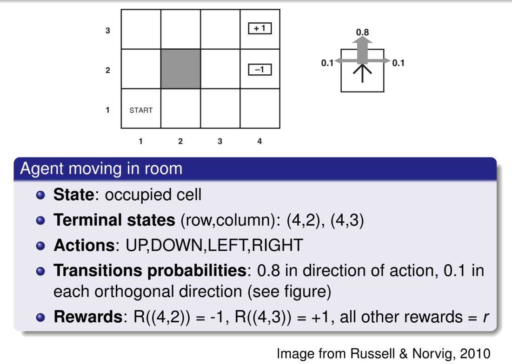

# Reinforcement Learning

It’s a learning setting, where the learner is an **Agent** that can perform a set of **actions** $A$ depending on its state in a set of **states** $S$ and the environment. In performing action a in state $s$, the learner receive an immediate **reward** $r(s,a)$ and we'd want to maximize the rewards.

In some states, some actions could be _not possible/valid_.

The task is to **learn a policy** allowing the agent to choose for each state $s$ the action $a$ **maximizing the overall reward**, including future moves which gives *delayed rewards*.

To deal with this delayed reward problem, the agent has to trade-off _exploitation_ and _exploration_:

- **exploitation** is action it knows give some rewards
- **exploration** experience _alternative_ that could end in bigger reward

This involves also a task called **credit assignment**, to understand which move was responsible for a positive or negative reward. 

> like playing a game and see the win or lose to understand if it was a bad move and in case don’t repeat it

## Sequential Decision Making

Setting:

- An agent needs to take a **sequence of decisions**
- The agent should **maximize** some **utility function**
- There is **uncertainty** in the result of a **decision**: if you take an action, it’s not deterministic that such action brings the agent to a certain state

## Markov Decision Process

We have:

- a set of state $S$ in which the agent can be at each instant
- A set of terminal states $S_G \subset S$ (possibly empty)
- A set of actions $A$ that the agent can make
- a transition model providing the probability of going to a state $s’$ with action $a$ from state $s$: $P(s’|s,a)\quad s,s’\in S,\ a\in A$
- a reward $R(s, a, s’)$ for making action a in state s which led the agent to state $s’$

||
|:--:|
|**MDP example**|

### Defining Utilities

We need to **define utilities** in order **to find the policy** for the agent, since it has to _maximize the reward_, and we need to formalize what it is the overall reward (so the utilities over time). We need:

- An **environment history** is a _sequence_ of states, since we are not only interested in immediate rewards but also in delayed rewards 
- **Utilities** are defined over environment histories
- We assume an **infinite horizon** (a priori _no constraint on the number of time steps_)
- We assume **stationary preferences** (if one history is preferred to another at time $t$, the same should hold at time $t’$ provided they start from the same state)
 
Utility is defined over history  so a sequence of states, two simple way to define utilities:

- **Additive rewards**: sum up each reward for each state in the sequence: $U([s_0, s_1, s_2, ...])= R(s_0)+R(s_1)+R(s_2)+...$

  > to make easier, $R(s_n)$ gives the reward of $R(s, a, s_n)$

- **Discounted rewards** $\gamma\in[0,1]$ is a decaying factor: $U([s_0, s_1, s_2, ...])= R(s_0)+\gamma R(s_1)+\gamma^2R(s_2)+...$

### Defining policies
A policy $\pi$ is a full specification of _what action_ to take _at each state_.
The utility in a non deterministic setting in which the **expected utility** of a policy is the utility of an environment history, taken in expectation over all possible histories generated with that policy.

An **optimal policy** $\pi^*$ is a policy maximizing expected utility (since starting from the same state doesn’t always produce the same state due to the non-deterministic factor).
For infinite horizons, optimal policies are stationary: they only depend on the current state (at a certain state it decide the action based only on the current state)

#### Examples on optimal policy

- If moving is very _expensive_, optimal policy is to _reach any terminal_ state asap
- If moving is very _cheap_, optimal policy is _avoiding the bad terminal_ state at all costs
- If moving gives _positive reward_, optimal policy is to _stay away from terminal_ states (resulting in never reaching an “exit”, so $\to$ discounted rewards)
  
### Utility of states
The utility of a state given a policy $\pi$ is: 
$$
U^\pi(s)=E_\pi\left[\sum_{k=0}^\infty \gamma^kR(S_{t+k+1})|S_t=s\right]
$$

Basically the utility of a state is the expected reward of moving from that state on given a certan policy $\pi$ of the encironment history that we can observe starting from a particular state with a particular policy. in particular

- $\sum$ from $0$ to $\infty$ since we are considering an infinite horizon
- the sum starts from $S_{t+1}$ since $k=0$ to infinity given that the state at time $t$ is $s$ so state $t+1$ will be the successive reached state with that particular policy (where $S_{t+k+1}$ is the state reached after $k$ steps using policy $\pi$ starting from $S_t=s$)
- since we are considering a delayed reward we got a $\gamma^t$ which will be our decaying factor for successive rewards

> Utility of a state $s$ given a certain policy$ \pi$ is the Expected reward $E_\pi$

The **true utility** of a state is its utility using the optimal policy: $U(s)=U^{\pi^*}(s)$

Given the _true utility_, an optimal policy is: $\displaystyle\pi^*(s)=\text{argmax}_{a\in A}\sum_{s'\in S}p(s'|s,a)U(s')$

> taking the action that probabilistically brings me to the best possible state, so I sum up over all possible destination states the probability of reaching this destination state, multiplying by the utility of the state
>
> in order to have an optimal policy you also need the transition model

So we have again two component that requires the other to be computed. This relationship between the utility and policy can be formalized using the **Bellman equation**:

$$ U(s)=R(s)+\gamma\ \max_{a\in A}\sum_{s'\in S}p(s'|s,a)U(s')$$

> *The utility of a state is its immedisate reward plus the expected discounted utility of the next state, assuming that the agent chooses an optimal action*

We have one equation for each state, but we don’t know the values of the utilities. The solution are the utilities of the states and are unique, but directly solving the set of equations is hard (non-linearities because of the max).

### Value iteration

An iterative approach to solve the Bellman equation:

1. initialize $U_o(s)$ to zero for all $s$
2. repeat:
   1. do Bellman update for each state s: $\displaystyle U_{i+1}(s)\leftarrow R(s)+\gamma\max_{a\in A}\sum_{s’\in S}p(s’|s,a)U_i(s’)$
   2. $i\leftarrow i+1$
3. until _max utility difference below a threshold_
4. return $U$

$U_0$ is the utility at the zero-th iteration

In the bellman update you use the utility computed before as it was the true utility

You iterate until utilities don’t change more than a threshold

### Policy iteration

An alternative to value iteration:

1. initialize $\pi_0$ randomly
2. repeat:
   1. policy evaluation, solve set of linear equations: $\displaystyle U_i(s)=R(s)+\gamma\sum_{s'\in S}p(s'|s,\pi_i(s))U_i(s')\quad \forall s\in S$ where $\pi_i(s)$ is the action that policy $\pi_i$ prescribes for state $s$
   2. policy improvement: $\pi_{i+1}(s)\leftarrow\text{argmax}_{a\in A}\displaystyle\sum_{s'\in S}p(s'|s,a)U_i(s')\quad \forall s\in S$
   3. $i\leftarrow i +1$
3. until _no police improvement_
4. return $\pi$

> $U_i$ is like an approximation

# Dealing with partial knowledge

Until now we assume perfect knowledge of everything (even probability). In most cases some of these information are not known, and those are where reinforcement learning is useful thanks to the exploration part.

Reinforcement learning aims at **learning policies by space exploration**.

**policy evaluation**: policy is given, environment is learned (passive agent)

**policy improvement**: both policy and environment are learned (active agent)

Passive because the agent receives the policy and applies it.

## Adaptive Dynamic Programming (ADP)

Algorithm based on policy evaluation:

1. Loop (tipically, since we explore the environment, we will do a lot of iterations)
   1. Initialize $s$
   2. Repeat:
      1. Receive reward $r$, set $R(s) = r$
      2. Choose next action $a \leftarrow \pi(s)$
      3. Take action $a$, reach step $s'$
      4. Update counts $N_{sa}\leftarrow N_{sa}+1;\quad N_{s'|sa}\leftarrow N_{s'|sa}+1$
      5. Update transition model $p(s'|s,a)\leftarrow N_{s''|sa}/N_{sa}\quad s''\in S$ (101: it normalizes the model given all the possibilites for a certain action in that state )
      6. Update utility estimate $U\leftarrow \text{PolicyEvaluation}(\pi, U, p, R, \gamma)$ (for the policy evaluation look at policy iteration from before)
   3. Until $s$ is terminal

Iterations bring better understanding of the environment in terms of its transitions.

### Characteristics

The algorithm performs **maximum likelihood estimation of transition probabilities**

Upon updating the transition model, it calls standard policy evaluation to update the utility estimate ($U$ is initially empty)

Each step is _expensive_ as it runs policy evaluation (and the number of steps is huge in order to the agent to learn something)

## Temporal-difference (TD) policy evslustion

_Approximate_ solution of ADP to reduce the “expensiveness”.

The idea is to avoid running policy evaluation at each iteration, but instead locally update utility:

- If transition from $s$ to $s′$ is observed:

  -  If $s′$ was always the successor of $s$, the utility of $s$ should be $$U(s)=R(s)+\gamma U(s')$$

  - The temporal-difference update rule updates the utility to get closer to that situation: $$U(s)\leftarrow U(s)+\alpha (R(s)+\gamma U(s')-U(s))$$

    where $\alpha$ is a learning rate (possibly decreasing over time)

Algorithm (loop):

1. initialize $s$
2. repeat:
   1. Receive reward $r$
   2. Choose next action $a \leftarrow \pi(s)$
   3. Take action $a$, reach step $s'$
   4. Update local utility estimate: $U(s)\leftarrow U(s)+\alpha(r+\gamma U(s') - U(s))$
3. until $s$ is terminal

If the state is new, you “remember” the reward for reaching it.

### Characteristics

- No need for a transition model for utility update
- Each step is much faster than ADP
- Same as ADP on the long run
- Takes longer to converge
- Can be seen as a rough efficient approximation of ADP

# Policy learning in unknown environment

Modify those algorithms to also learn the policy instead of only evaluating it.

**Policy learning** requires combining _learning the environment_ and _learning the optimal policy_ for the environment: an option is to take ADP and replace the step policy evaluation with policy computation.

There is a problem: The knowledge of the environment is incomplete. A greedy agent usually learns a suboptimal policy (lack of  exploration).

## Exploration-exploitation trade-off

- Exploitation consists in following promising directions given current knowledge

- Exploration consists in trying novel directions looking for better (unknown) alternatives

- A reasonable trade-off should be used in defining the search scheme:

  - ϵ-greedy strategy: choose a random move with probability ϵ, be greedy otherwise

  - assign higher utility estimates to (relatively) unexplored state-action pairs: $$U^+(s)=R(s)+\gamma\max_{a\in A}f\left(\sum_{s'\in S}p(s'|s,a)U^+(s'), N_{sa}\right)$$

    with f increasing over the first argument and decreasing over the second.

> probability $1-\epsilon$ is greedy, random with $\epsilon$ probability
>
> higher utility estimate means give a bonus if that state has not been explored much
>
> $N_{sa}$ number of observed state $s$ and took action $a$

It’s common going with solution in which each iteration runs faster.

## TD policy learnin

To learn the $<\text{utility of the state}, \text{action}>$ pairs (action utility):

- TD policy evaluation can also be adapted to learn an optimal policy
- If TD is used to learn a state utility function, it needs to estimate a transition model to derive a policy
- TD can instead be applied to learn an action utility function $Q(s, a)$ (I don’t need the transition model, I incorporate it in $Q$)
- The optimal policy corresponds to: $\pi^*(s=\text{argmax}_{a\in A}Q(s,a))$

## SARSA

The algorithm adapted to _learn an utility-action pair_ is SARSA.

Here I’m updating the utility-action pair so I need to look at the next utility-action pair.

### SARSA: on-policy TD learning:

1. Initialize s
2. Repeat:
   1. Receive reward $r$
   2. Choose next action $a\leftarrow \pi^\epsilon(s)$
   3. Take action $a$, reach step $s’$
   4. Choose action $a’\leftarrow \pi^\epsilon(s’)$ (this point is added in this variant)
   5. Update local utility estimate $Q(s,a)\leftarrow Q(s,a)+\alpha(r+\gamma Q(s', a')-Q(s,a))$
3. Until $s$ is terminal

This is an algorithm that explores the space and finds rewards of new states in within and updates the utility estimate of the state-action pair and it use it in order to find the updated policy. 

## Q-learning

Another option is to not take another action and take the max current utility action pair function:

### Q-learning: off-policy TD learning

1. Initialize $s$
2. Repeat:
   1. Receive reward $r$
   2. Choose next action $a\leftarrow \pi^\epsilon(s)$
   3. Take action $a$, reach step $s’$
   4. <s>Choose action $\cancel{a’\leftarrow \pi^\epsilon(s’)}$ (this point is added in this variant)</s>
   5. Update local utility estimate $Q(s,a)\leftarrow Q(s,a)+\alpha(r+\gamma\bold{\text{\bf max}_{a'\in A}} Q(s', a')-Q(s,a))$
3. Until $s$ is terminal

## SARSA vs Q-learning

- SARSA is **on-policy**: it updates $Q$ using the current policy’s action
- Q-learning is **off-policy**: it updates $Q$ using the greedy policy’s action (which is NOT the policy it uses to search)
- Off-policy methods are _more flexible_: they can even learn from traces generated with an unknown policy
- On-policy methods tend to _converge faster_, and are easier to use for continuous-state spaces and linear function approximators (see following slides)

# Function Approximation

Main aspect of Deep Reinforcement Learning: until now we thought about a tabular representation of utility functions (states or utility-action pairs).

The space grows while you explore it, and sometimes the space could also be continuous.

So you approximate:

- All techniques seen so far assume a **tabular representation** of _utility functions_ (of states or actions)
- Tabular representations do not scale to large state spaces (e.g. Backgammon has an order of $10^{20}$ states)
- The solution is to rely on **function approximation**: approximate $U(s)$ or $Q(s, a)$ with a parameterized function.
- The function takes a state representation as input (e.g. $x,y$ coordinates for the maze)
- The function allows to generalize to **unseen states **(and it allows to compute the utility of states you never saw)

>  It produces the Utility of the state of the utility-action pair

Instead of using a table that for each state gives you a value, you use a function that takes the state represented feature-based and gives the utility multiplied by the weight and the weight are the one to learn.

State utility function approximation: State $s \to \phi(s)$ [_feature vector_] * $\theta$ [_parameter vector_] = **estimated value**

Action utility function approximation:

Q learning: $<state, action> \to$ Q table $\to$ Q-value

Deep Q learning: state $\to$ neural network $\to \begin{cases}Q-\text{value action } 1\\Q-\text{value action } 2\\.\\.\\Q-\text{value action } N\end{cases}$ 

### How you can do the learning process

If $U$ is a function approximating the table I call it $U_{\theta}$ where $\theta$ are the parameters (so we don’t have the table).

TD learning: state utility

- TD error $\displaystyle E(s,s') = \frac12(R(s)+\gamma U_{\theta}(s')-U_\theta(s))^2$

- Error gradient wrt function parameters $\nabla_\theta E(s,s')=(R(s)+\gamma U_\theta(s')-U_\theta(s))(-\nabla_\theta U_\theta(s))$

- Stochastic gradient update rule $$\begin{aligned}\theta &= \theta-\alpha\nabla_\theta E(s,s')\\&=\theta +\alpha(R(s)+\gamma U_\theta(s')-U_\theta(s))(\nabla_\theta U_\theta(s))\end{aligned}$$

1. the $R(s)+\gamma U_{\theta}(s')$ is what you want your utility to be close to (target), subtracting the current $U_\theta(s)$ (to get the error)

   > squared to penalize more

2. Compute the update step for that utility function with the gradient

3. $\alpha$ is the learning rate

Almost the same on Q-learning: TD learning: action utility (Q-learning):

- TD error $E((s,a),s')=\frac12(R(s)+\gamma\displaystyle\max_{a’\in A}Q_{\theta}(s',a')-Q_{\theta}(s,a))^2$

- Error gradient wrt function parameters $\nabla_\theta E((s,a),s')=(R(s)+\gamma\displaystyle\max_{a’\in A}Q_{\theta}(s',a')-Q_{\theta}(s,a))(-\nabla_\theta Q_{\theta}(s,a))$

- Stochastic gradient update rule $$\begin{aligned}\theta &= \theta-\alpha\nabla_\theta E((s,a),s')\\ &=\theta +\alpha\left(R(s)+\gamma \max_{a’\in A}Q_{\theta}(s',a')-\max_{a’\in A}Q_{\theta}(s,a)\right)(\nabla_\theta Q_{\theta}(s,a))\end{aligned}$$