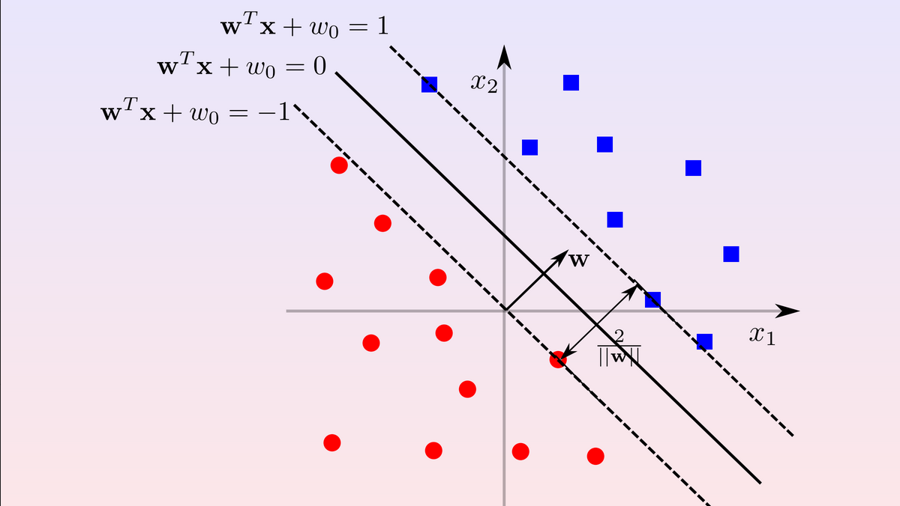
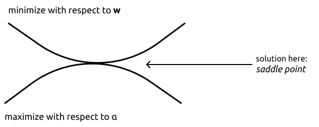
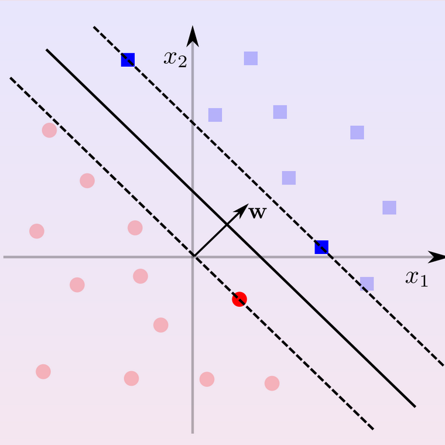

# Support Vector Machines

Support Vector Machine, SVM from now on, are linear classifiers that separate using a **large margin classifier** which solution depends only on a small subset of the traing examples called **support vector**. It's very important to note that it has a sound generalization theory (not to study) and they can be easily extended to non linear separation retaining the separation properties thanks to *kernel machines*.

# Maximum margin Classifier & Hard Margin SVM 

Let's try to formalize the margin. We already know that $yf(x)$ is the confidence on the correct prediction, if negative the prediction is wrong otherwise if positive correct and the value is the confidence on the prediction. Now suppose we have a classifier that correctly separates with no training errors. If this is the case the minimum value among the training examples is called *confidence margin* and it's written like
$$
\rho = \min_{(\bold x, y)\in D}yf(\bold x)
$$

Since it depends on $w$ we can compute the distance from the minimal distance to our classifier and it's called **geometric margin** which is formalized like 
$$
\frac{\rho}{\|\bold w\|} = \min_{(\bold x, y)\in D}\frac{yf(\bold x)}{\|\bold w\|}
$$

Ideally we want to maximize the last formula in order to get $w$ in order to maximize the margin. However if we put in an optimization problem we have actually one degree of freedom that is being removed. Suppose we have a solution where
$$
\mathbf{w}^T\mathbf{x} + w_0 = 0
$$

now if we want to characterize further the plane we can, for example, multiply the terms with an $\alpha \neq 0$ and still we will return to a formula that look like before since we can incorporate the $\alpha$ in our formalization. This is because there is an infinite number of equivalent formulation for the same hyperplane even with different parameters.

We can counter this problem through the introduction of the *canonical hyperplane* in which we set the constraint that $\rho$ must be equal to a number given a priori (in our case we take 1) in order to get:
$$
\rho = \min_{(\bold x, y)\in D}yf(\bold x) =1
$$
and it's geometric margin will be $\displaystyle \frac{\rho}{\|\bold w\|} =\frac{1}{\|\bold w\|}$

> the numerical value in the geometric margin must match

As we can see from the image above the two dotted lines are the two canonical hyperplanes with their $\rho$ set to 1 so summing their respective geometric margin we get that the total geometric margin is equal to $\displaystyle \frac{2}{||\mathbf{w}||}$.

We can take this and convert it to an optimization problem.

First of all we want to maximize the margin so $\displaystyle \frac{2}{||\mathbf{w}||}$ and we want to do it by enforcing all examples to stay on the correct part of the hyperplane for both canonical ones. Formalized will be
$$
\text{max} \frac{2}{||\mathbf{w}||}\space 
\\
 \text{s.t.}\\\forall x_i:y_i = 1 \Rightarrow \mathbf{w}^T x_i + w_0 \geq 1 
 \\\And \\
 \forall x_i:y_i = -1 \Rightarrow \mathbf{w}^T x_i + w_0 \leq -1 
$$

and the term to maximize can be inverted in order to get 
$$
\text{min} \frac{||\mathbf{w}||}{2} = \frac{\sqrt{w^Tw}}{2}
$$

which is not a quadratic function but it's monotonic so if we found a maximum it will be the same even squared so we can minimize doing $\text{min} \frac{||\mathbf{w}||^2}{2}$ and to summarize the constraints we can just say $yf(x) \geq 1$ since it's our confidence

## Margin Error Bound (just a citation not study material)

**Margin Error Bound**: $\nu +\sqrt{\displaystyle{\frac cm(\frac{R^2\bigwedge^2}{\rho^2}\ln^2m+\ln(\frac1\delta))}}$

The probability of test error so depends on:

- $\nu$ is number of margin errors (samples that are outside the confidence margin, correcly classified samples with low confidence)

- $m$ training example in the $\displaystyle{\sqrt{\frac{\ln^2 m}{m}}}$ so the result goes down if $m$ goes up

- $R$ is the radius of the space containing all the samples

- larger the margin $\rho$, the smaller test error (so we want the margin $\displaystyle\frac 2{\|\bold w\|}$ to be large)

  if $\rho$ is fixed to 1, maximizing margin corresponds to minimizing $||\bold w||$

- $c$ is a constant

> it makes an upper bound of the generalization error (?)

The name **hard margin** is because we require <u>all</u> examples to be at confidence margin at least one.

# Learning Problem

The learning problem is formalized like $\text{min} \frac{||\mathbf{w}||^2}{2}$ with linear constraints in w $y_i(\mathbf{w}^T\mathbf{x}_i + w_0) \geq 1, \forall(\mathbf{x}_i,y_i) \in D$. Still this is a quadratic optimization problem which means that is convex and it has only one global optimum. Problem now is that we need to minimize respect to the constraints and one way to do this is the **KKT approach** 

##  Karush-Kuhn-Tucker (KKT) approach

With this approach basically we turn a *constrained problem* into an *uncostrained* one with the same solution. To do this suppose we have $f(z)$ to minimize with some constraints like $g_i(z) \geq 0 \space \forall \mathbf{i}$. Now how can we het rid of the constraints? To do so we introduce a non negative variable called **Lagrange multiplier** noted with $\alpha_i \geq 0$ for each constraint and we rewrite the optimization problem as a **Lagrangian**:
$$
\min_z \max_{\alpha \geq 0} f(z) -\sum_i \alpha_i g_i(z)
$$
If we find an optimum of this lagrangian called $z^*$ it's still an optimum for the original constrained problem. That's because suppose we find a solution called $z'$ than:

- if at least one constraint is not satisfied ($\exists i\ |\ g_i(z')<0$), maximizing over $\alpha_i$ leads to an infinite value;
- if all constraints are satisfied, maximizing over $\alpha$ sets all elements in the sum to zero so that $z'$ is a solution for $\displaystyle\min_zf(z)$.

Applying the approach to our learning problem we will get that

$$
\begin{aligned}
\min_{\mathbf{w},w_0}  \space &\space \frac{1}{2} ||\mathbf{w}||^2 
\\
\text{subject to:} &
\\
& y_i(\mathbf{w}^T\mathbf{x}_i + w_0) \geq 1
\\
& \forall(\mathbf{x}_i, \mathbf{y_i}) \in D
\end{aligned}
$$

where :

- $z$ will be our $\mathbf{w}$ so $f(z)$ will be $\frac{1}{2} ||\mathbf{w}||^2$
- the constraint will be $g_i(z) \geq 0$ so we need to turn $y_i(\mathbf{w}^T\mathbf{x}_i + w_0) \geq 1$ into the $g_i$ which will become $y_i(\mathbf{w}^T\mathbf{x}_i + w_0) -1 \geq 0$
  
By substituiting the new obtained terms we get
$$
L(\bold w, w_0, \alpha)=\frac{\|\bold w\|^2}2-\sum^m_{i=1}\alpha_i(y_i(\bold w^T \bold x_i+w_0)-1)
$$

> m = |D|

This lagrangian should be ninimized with respect to $\mathbf{w}$ and $w_0$ and maximized with respect to $\alpha_i$. The solution is called saddle point and it's located where ther is the solution for both problems

Going further with the calculus we get that

$$
L(\bold w, w_0, \alpha)=\frac{\|\bold w\|^2}2-\sum^m_{i=1}\alpha_i(y_i(\bold w^T \bold x_i+w_0)-1)
$$

which is our lagrangian. Now we want to minimize with respect to $\bold w, w_0$ and maximize with respect to $\alpha$. We are interested in computing the gradient respect to our **primal variables** $\mathbf{w}$ and $w_0$

So we take $\displaystyle\nabla_\bold w L=\nabla_\bold w \frac{\bold w^T \bold w}{2}-\nabla_\bold w \sum_i \alpha_iy_i\bold w^T \bold x = \frac{\not 2\bold w}{\not 2}-\sum_i \alpha_iy_i \bold x$

and now we set $\displaystyle\bold w-\sum_i \alpha_iy_i \bold x = 0$ getting $\displaystyle\bold w = \sum_i \alpha_iy_i \bold x$, but this is not the solution because $\bold w$ is defined in terms of $\alpha$

Than we can also take the derivative in order to get
$$
\frac{\delta L}{\delta w_0}=\frac{\delta(-\displaystyle\sum_{i}\alpha_iy_iw_0)}{\delta w_0} = -\sum_i\alpha_iy_i = 0\to\sum_i\alpha_iy_i = 0
$$

---

CERCASI ANIMA PIA CHE TRASCRIVI LA FORMULA LEZ 18.6 DAL MIN 46:00 O DALLE SLIDE

---
After all the steps we get a function which is only a function of the dual variables (the alphas) without our primal variable which is like

$$
-\frac{1}{2} \sum_i \sum_j \alpha_i y_i \alpha_j y_j x_i^Tx_j + \sum \alpha_i
$$

which needs to be maximized respect to $\alpha$ with constraints of
$$
\begin{aligned}
  \alpha_i \geq 0 & \text{ }\text{ }\text{ }\text{ } \forall i
  \\
  \sum_i \alpha_i y_i &= 0
\end{aligned}
$$ 
But still this result is a quadratic optimization problem respect to alpha. In all of this we can see that the beforementioned **primal variables** are missing and replaced with a new pair of variables which will be called **dual variables**(the alphas). This new type of formalization is called **dual formulation**

The result is that $f(\bold x) = \bold w^T \bold x + w_0$ can be written both in form of the primal and of the dual because we know that w is equal to $\displaystyle\bold w = \sum^m_{i=1}\alpha_i y_i \bold x_i$

## Decision fucntion

When we did the gradient with respect to $\mathbf{w}$ previously we got $\displaystyle\bold w = \sum_i \alpha_iy_i \bold x$. Now if we plug it into our f(x) we get that
$$
f(\mathbf{x})=\mathbf{w}^T\mathbf{x} + w_0 = \sum_i \alpha_iy_i \mathbf{x}_i^T\mathbf{x} + w_0
$$

The decision $f(\bold x)$ (defined as **decision function**) on $\bold x$ is basically taken as a linear combination of dot products between training points and $\bold x$, so if $\bold x_i$ is similar to $\bold x$ it will have a high dot product because here the dot product works kind of a similarity between the points. Plus the weights of the combination are $\alpha_i y_i$ where large $\alpha_i$ implies large contribution toward class $y_i$

## KKT conditions

To understand wheter a training examples contributes or not to our decision function can be found by appliying KKT. The formulation remains the same so:
$$
L(\bold w, w_0, \alpha)=\frac{\|\bold w\|^2}2-\sum^m_{i=1}\alpha_i(y_i(\bold w^T \bold x_i+w_0)-1)
$$

In the optimal solution  $\displaystyle \alpha_i(y_i(\bold w^T \bold x_i+w_0)-1)$ should be $= 0$, either:

- $\alpha_i = 0$, so the example $\bold x_i$ does not contribute to the final solution
- if $\alpha_i > 0$ than $y_i(\bold w^T\bold x_i+w_0)=1$, so the confidence for the example should be $1$

Graphically we will achieve something like this:

In the image the whited out examples are the ones with $\alpha_i = 0$ and they do not contribute to the decision. The examples which contributes to the example are the one in the dotted lines and the hav \alpha_i > 0$ and are examples for which $y_i(\bold w^T\bold x_i+w_0)=1$. Still the dotted lines are the confidence 1 hyperplanes. These minimal confidence hyperplanes called **support vectors**. All others do not contribute in any way to our decision. SVM are *sparse* which means that they have few support vectors.

Now if we take a step back we know that our $f(x)$ is formed as $w^Tx + w_0$. While we found how to compute the first term we still to resolve how to compute the bias

### KKT bias

To compute the bias we can still use the KKT solution we reached before. Given the KKT has found an optimal solution we know that $y_i(\bold w^T\bold x_i+w_0)=1$ must be complied. Fact is we know already that this condition is satisfied so we can just resolve the equation computing for $w_0$ where
$$
  y_i(\bold w^T\bold x_i+w_0)=1
  \\
  y_i\bold w^T\bold x_i+y_iw_0=1
  \\
  w_0 = \frac{1-y_iw^Tx_i}{y_i}
$$

> Usually for numerical robustness we compute the bias over all support vectors

# Soft Margin

Until now we just talked about Hard Margin