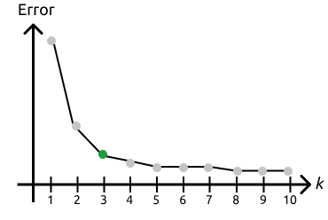
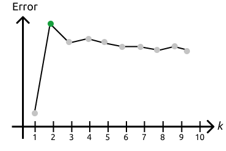
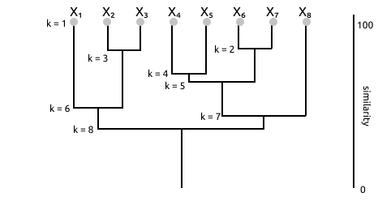

# Unsupervised Learning

## Setting:

- supervised learning requires the availability of labelled examples (an extremely expensive process)
- sometimes it is not even known how to label examples
- **unsupervised** techniques can be employed to group examples into **clusters** (groups)

It’s often the first step when looking at some data.

## k-means

### Setting

Simplest approach for _clustering_ is $k$-means; we decide a priori the number of clusters $k$ where each cluster $i$ will be represented by its mean $\mu_i$. Generally we'd want to associate examples to the cluster with the closer mean.

### Algorithm

1. We initialize all the clusters with random means $\mu_1,...,\mu_k$
2. Iterate until no mean changes:
   1. Assign each example to the cluster with the closest mean
   2. Update the mean of each cluster according to the new assigned examples

## (Dis)Similarity

In order to cluster we introduce the concept of **similarity** which tells how much two different examples differs from one another.

- (if samples are vectors) Standard Euclidean distance in $\R^d$: $\displaystyle d(\bold x, \bold x')=\sqrt{\sum_{i=1}^d(x_i-x_i')^2}$ 
- Generic Minkowski metric for $p \ge 1$ (where $p$ is an integer): $\displaystyle d(\bold x, \bold x')=\left(\sum_{i=1}^d|x_i-x_i'|^p\right)^{\frac1p}$
  - generalized and more used metric respect to the euclidean distance. By setting the parameter $p$ we get with 1 for example the *Manhattan distance* and with 2 the beforementioned *Euclidean distance*
- Cosine similarity (cosine of the angle between vectors): $\displaystyle s(\bold x, \bold x')=\frac{\bold x^T\bold x'}{\|\bold x\|\| \bold x'\|}$

**Metric learning** is important: instead of assuming a predefined metric, you _learn_ it from data (maybe some feature have different weights)

## Quality of clusters

There are different criteria to analyze the quality of a cluster. We will introduce only the **Sum-of-squared error criterion**. This measure tells how bad an approximation of the clusters is using the mean.
In this measure we take the $i$-th clsuter where $n_i$ will be the number of samples in cluster $D_i$ and $\mu_i$ be the sample mean $\displaystyle \mu_i=\frac{1}{n_i}\sum_{\bold x\in D_i}\bold x$. The sum of squared errors will be
$$
E=\sum_{i=1}^k\sum_{\bold x\in D_i}\|\bold x -\mu_i\|^2
$$

It measures the squared error incurrent in representing each sample with its cluster mean.

## Gaussian Mixture model

Another method of clustering is the **Gaussian Mixture Model** where we still decide a priori the number of clusters but we treat each cluster as a Gaussian Distribution in which for every cluster we need to estimate the *mean* and possibly the *variance*

Problem: if we have data and we have to fit the Gaussian, we can make Maximum-Likelihood of parameters (mean and variance) but you don’t know each example at which gaussian it corresponds; so we adopt the **Expectation-Maximization** approach where:

1. Compute _expected cluster_ assignment given the current parameter setting
2. _Estimate parameters_ given the cluster assignment
3. _Iterate_

> **latent variable** -> are variables that are not directly observed but are rather inferred like the assign an example to an unknown cluster

### Setting

 A dataset of $x_1, . . . , x_n$ examples is observed
- For each example $x_i$, cluster assignment is modelled as $z_{i1}, . . . , z_{ik}$ binary latent (unknown) variables
- $z_{ij} = 1$ if Gaussian $j$ generated $x_i$, $0$ otherwise [_hot encoding_]
- Parameters to be estimated are the $\mu_1, . . . , \mu_k$ Gaussians means
- All Gaussians are assumed to have the same (known) variance $\sigma^2$

> hot encoding: a vector of $k$ binary variables, $z_{ij} = 1$ if the example $x_i$ came from gaussian $j$, $0$ otherwise (it represent the cluster assigned)

### Algorithm

1. initialize the parameters (as hypothesis) $h = \langle\mu_1,...,\mu_k\rangle$ randomly
2. Iterate until the difference in _Maximum Likelihood_ is below a certain threshold:
   - **E-step**: calculate expected value $E[z_{ij}]$ of each latent variable assuming current hypothesis $h = \langle\mu_1, . . . , \mu_k\rangle$ holds
   - **M-step**: calculate a new ML hypothesis $h' = \langle\mu'_1, . . . , \mu'_k\rangle$ assuming values of latent variables are their expected values just computed. Replace $h \leftarrow h'$ (at the end of this step we have a new hypothesis that replaces the current, and repeat)

Before going into the computation we need to remember that $z_{ij}$ whether example $x_i$ is generated from gaussian $j$

The computation goes like
- **E-step** The expected value of $z_{ij}$ is the probability that $x_i$ is generated by Gaussian $j$ assuming hypothesis $h = \langle\mu_1, . . . , \mu_k\rangle$ holds: $\displaystyle E[z_{ij}]=\frac{p(x_i|\mu_j)}{\displaystyle\sum_{l=1}^k p(x_i|\mu_l)} = \frac{\displaystyle	\exp(-\frac{1}{2\sigma^2}[x_i-\mu_j]^2)}{\displaystyle 	\sum_{l=1}^k	\exp(-\frac{1}{2\sigma^2}[x_i-\mu_l]^2)}$
  (the coefficient of the gaussian is absent because is cancelled out with the denominator because it’s constant)
- **M-step**: The maximum-likelihood mean $\mu_j$ is the weighted sample mean, each instance being weighted by its probability of being generated by Gaussian $j$: $\mu'_j=\frac{\displaystyle\sum_{l=1}^n E[z_{ij}]x_i}{\displaystyle\sum_{l=1}^n E[z_{ij}]}$

## General Expectation-Maximization (EM)

EM is a general strategy for dealing with optimization in a setting with uncertain data.
Generically we mean we are given a dataset made of an observed part $X$ and an unobserved part $Z$ (for example in clustering is the cluster assignment) and we wish to estimate the hypothesisi maximizing the expected log-likelihood for the data, whith expectation taken over unobserved data which formalizes in:

$$
h^* = \argmax_h E_Z [ln \space p(X,Z|h)]
$$

so we want to maximize out hypotesis over log likelihhod of $X$ and $Z|h$ taking the expectation of $Z$ which is not observed.

### Problem
The unobserved data $Z$ should be treated as random variables governed by the distribution depending on $X$ and $h$. The problem is that we don't know $h$ which is what we want to maximize and in order to face the fact we don't know $h$ when we want to estimate $Z$ and we need $Z$ to estimate $h$ we do an iterative procedure

### Generic Algorithm

1. Initialize hypothrsis $h$ 
2. Iterate until convergence
   1. **E-step**: computes the expected likelihood of an hypothesis $h’$ for the full data, where the unobserved data distribution is modelled according to the current hypothesis $h$ and the observed data: $$Q(h', h)=E_Z[\ln p(X,Z|h')|h,X]$$ In this we have the log of the likelihood of the data given the new hypothesis. This likelihood is computed in expectation over Z and this expectation is computed according to the current version of the hypothesis and the available data
   2. **M-step**: replace the current hypothesis with the new one maximizing $Q(h', h)$: $h\leftarrow \text{argmax}_{h'}Q(h',h)$

In the case of a GMM:

1. the likelihood $p(X,Z|h')$ will be of an example is: $$p(x_i, z_{i1},...,z_{ik}|h')=\frac1{\sqrt{2\pi\sigma}}\exp\left[-\sum_{j=1}^kz_{ij}\frac{(x_i-\mu'_j)^2}{2\sigma^2}\right]$$
> the vector $z_{i1},...,z_{ik}$ at step 1 is the hotencoded vector
> 
> if $z$ is one hot, only the gaussian with 1 will be recovered.
>
> The sum is weighted by $z$
2. the dataset log-likelihood is: $\displaystyle\ln p(X,Z|h) = \sum_{i=1}^n{\left (\ln\frac{1}{\sqrt{2\pi\sigma}}-\sum_{j=1}^{k}z_{ij}\frac{(x_i-\mu'_j)^2}{2\sigma^2}\right)}$
> in log, the product becomes a sum

Now we need to get the expectation over $Z$ which is computed using the current version of the hypothesis.

### E-step
Expectation over $Z$ of $\ln p (X, Z | h’)$ is: 
$$
\begin{aligned}
   E_Z[\ln p(X,Z|h')] &= E_Z\left[\sum_{i=1}^n{\left (\ln\frac{1}{\sqrt{2\pi\sigma}}-\sum_{j=1}^{k}z_{ij}\frac{(x_i-\mu'_j)^2}{2\sigma^2}\right)}	\right] 
   \\
   &= \sum_{i=1}^n{\left (\ln\frac{1}{\sqrt{2\pi\sigma}}-\sum_{j=1}^{k}E[z_{ij}]\frac{(x_i-\mu'_j)^2}{2\sigma^2}\right)}
\end{aligned}
$$
The expectation is a linear operator (the expectation of two variables is the sum of the two expectations) so we cab apply the expectations directly to the unknown term because the rest is constant since its an expectaion over $Z$
> everything that’s not $z$ is a constant in terms of expectation because this is the expectation of $z$

Using the current version of the hypothesis, expectation is computed as: $\displaystyle E[z_{ij}]=\frac{p(x_i|\mu_j)}{\displaystyle\sum_{l=1}^k p(x_i|\mu_l)}=\frac{\displaystyle\exp-\frac1{2\sigma^2}(x_i-\mu_j)^2}{\displaystyle\sum_{l=1}^k\exp-\frac1{2\sigma^2}(x_i-\mu_l)^2}$
  
>the expectation is the density for gaussian $j$ normalized over all possible gaussians (the probability that $x_i$ comes from that gaussian)

### M-Step
The likelihood maximization gives:
$$
\begin{aligned}
   \text{argmax}_{h’}Q(h’,h) = \space &\text{argmax}_{h’}\sum_{i=1}^n{\left (\ln\frac{1}{\sqrt{2\pi\sigma}}-\sum_{j=1}^{k}E[z_{ij}]\frac{(x_i-\mu'_j)^2}{2\sigma^2}\right)}=
   \\
   &\text{argmin}_{h'}\sum_{i=1}^n\sum_{j=1}^kE[z_{ij}](x_i-\mu_i')^2
\end{aligned}
$$

We'd want to maximize over $h'$, over the new hypthesis. If i want to maximize the likelihood we want to maximize over $\mu'$ so we can get rid of the first term since it's constant (same for $\sigma$) and we're left with $(x_i-\mu'_j)^2$. Then we change the maximization to a minimization in order to get rid of the minus (inverts it)

After we zero the derivative with respect to each mean $\mu_j$ we get:

$$
\frac\delta{\delta\mu_j}=-2\sum_{i=1}^nE[z_{ij}](x_i-\mu_j')=0
\\
\mu_j'=\frac{\displaystyle \sum_{i=1}^nE[z_{ij}]x_i}{\displaystyle\sum_{i=1}^nE[z_{ij}]}
$$

> since there is no component that connect the various means we can compute them one by one when we do the derivation

## How to choose the number of clusters

Until now we always assumed that we knew the number of clusters but this is not always the case. Maybe our knowledge gives us an intuition on the number of clusters, but we can try to find out the number of clusters.

### Elbow method

Very simple method. If we use the _mean squared error_, increasing the number of clusters always decreases the error. We need to **trade-off quality of clusters with quantity** of clusters, so we stop increasing number of clusters when the advantage is limited.

||
|:--:|
|**Elbow Method**|

Approach:

1. **Run** clustering algorithm for increasing number of clusters (can run it on any algorithm which needs at start the number of clusters)
2. **Plot** the clustering evaluation metric, for different $k$ and we connect the dots
3. Try to see where the curve that is going down has an **elbow**, so when the error starts to be less important and we choose that number of clusters

It’s a bit ambiguous method because the choice is made by eye, or also computing the angle, but there is no formal definition on when to stop.

### Average Silhouette

The idea: Increasing the numbers of clusters makes each cluster more homogeneous internally, but also different clusters become more similar. The silhouette method computes this **dissimilarity** between clusters, to _trade-off intra-cluster similarity and inter-cluster dissimilarity_.

#### Silhoutte coefficient for example $i$

1. Compute the average dissimilarity between every example $i$ and examples of _its_ cluster $C$: $$a_i = d(i, C)=\frac1{|C|}\sum_{j\in C}d(i, j)$$

   > it’s the average distance between $i$ and the examples of its cluster ($j$ is every other example), it’s made for each $i$ - intra cluster similarity

2. Compute the average dissimilarity between $i$ and examples of _each_ cluster $C'\not = C$, and take the minimum: $$b_i=\min_{C'\not=C}d(i, C')$$

   > inner cluster dissimilarity, min = with the closest cluster

3. The silhouette coefficient is: $$s_i=\frac{b_i-a_i}{\max(a_i, b_i)}$$

   > the difference between the two values, normalized by the maximum

Then, I run the clustering algorithm up to a certain point, I compute the silhouette for each clustering, I average it over all example and I plot it. I choose $k$ where the average silhouette coefficient is maximal

||
|:--:|
|**silhouette method**|

---

In **Gaussian Mixture Model** there is also another solution based on Bayesian non parametric.

GMM assumes you already know $k$, in Bayesian terms we can combine GMM with the prior on the number of clusters. It computes _for every possible values_ of $k$ and allows you to model options in which GMM can have different number of gaussians and depending on the priori process looks like, it _favours number of gaussians that well fits your data_ combined with a _small number of clusters that it’s embedded with priori_ - It’s Bayesian non-parametric, instead of having parameters, it adds a prior process that automatically adjust the value of parameters

$\to$ **Dirichlet process mixture model**

---

## Hierarchical clustering

Up to now we took our data and divided them in $k$ clusters (flat). In many situation, data groups have a hierarchy.

A **hierarchy** of clusters can be built in greedy ways:

- **Top-down**:
  1. start with a single cluster with all examples
  2. recursively split clusters into subclusters, accordingly to a certain measure and repeat
- **Bottom up**:
  1. start with $n$ clusters of individual examples (singletons)
  2. recursively aggregate pairs of clusters (the closest groups everytime)

**Dendrogram** (an example of bottom up):

||
|:--:|
|**Dendogram bottom up**|

### Agglomerative hierarchical clustering (bottom-up)

Algorithm:

1. Initialize:
   - final number of cluster $k$
   - initial number $\hat k = 1$
   - initial clusters $D_i=\{x_i\},\ i \in 1,..., n$
2. while $\hat k > k$:
   - find the pair of closes clusters $D_i, D_j$ (based on some similarity measure)
   - merge those clusters into a single cluster
   - $\hat k = \hat k -1$

You can stop whenever the problem requires.

#### Similarity measures

_Between clusters/sets_

- **Nearest-neighbour**: _minimal distance_ between the elements in the two sets $\displaystyle d_{\min}(D_i, D_j)=\min_{\bold x\in D_i, \bold x'\in D_j}\|\bold x - \bold x'\|$
- **Farthest-neighbour**: _maximal distance_ between the elements in the two sets $\displaystyle d_{\max}(D_i, D_j)=\max_{\bold x\in D_i, \bold x'\in D_j}\|\bold x - \bold x'\|$
- **Average distance**: _average the distances_ between elements in the two sets $\displaystyle d_{\text{avg} }=\frac{1}{n_in_j}\sum_{\bold x\in D_i}\sum_{\bold x'\in D_j}\|\bold x-\bold x'\|$
- **Distance between means**: just the _distance between the two means_ $d_{\text{mean}}(D_i, D_j)=\|\bold \mu_i - \mu_j\|$

$d_{\min}$ and $d_{\max}$ are more sensitive to outliers

$d_{\text{avg}}$ distance can be expensive

### Stepwise optimal hierarchical clustering

It uses some external quality metric.

Algorithm: it’s the same as before (agglomerative hierarchical clustering) but using the external metric for choosing which cluster to merge.

The problem is, that even this approach is greedy.