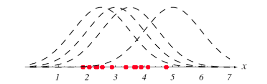
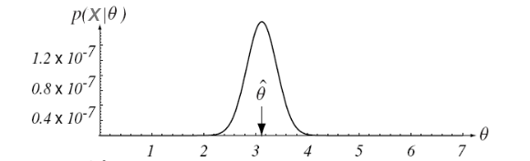
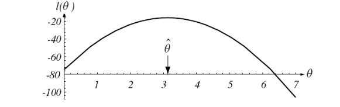
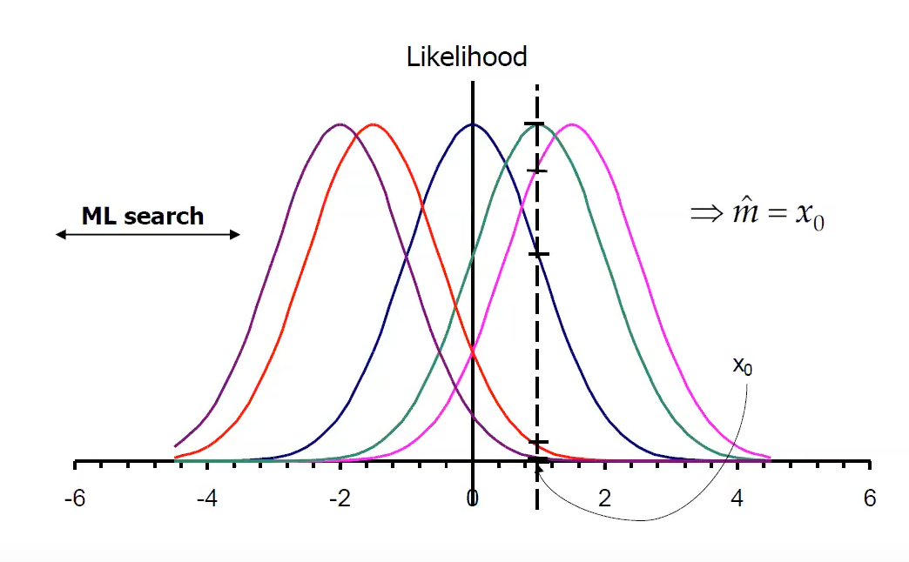
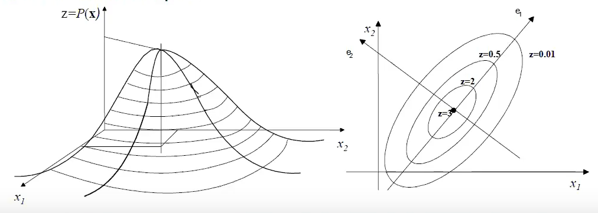

# Estimation basics

In estimation theory, stochastic signlas can be subdivided in three categories:

- **Noisy Deterministic signals**
  - The information source is completely known. Noise interference can be read only during the transmission or acquisition phase
- **Noisy Parametric signals**
  - The information source is only partially known. Observations allow estimating the random parameters associated to their relative signals
- **Noisy Random signals**
  - The signal is completely unknown. In this case every estimation relies only on the observation given since there is no other knowledge to leverage.

For the course will only be treated the second and third category since they are most common in most real world applications.

Before talking about the estimation problem though we need some notations in order to get a better formalization.

Let $x = \{ x_1,x_2,....x_n \}$ be a vector of $n$ features of an unknown pdf (e.g. the features extracted from an image of a person). This vector in a N Dimensional feature space in which our vector will identify one point in the space.

Let $X = \{ X_1,X_2,....X_N \}$ be the set of $N$ samples we have which we will use to crete our model. These samples will be called *training samples* and will be the base to estimate our model.

# Parametric estimation

In parametric estimation we assume we know the shape of the probability function of the parameters. These parameters related to the model $p(x)$ are stored in a vector called $\theta$ where $\theta =(\theta_1,\theta_2,....,\theta_n)$ . And since our model is parametric (depends from certain parameters) his density won't be based only on the training itself so we underline this by using the notation $p(x|\theta)$

So assuming having a set of independent training samples $X$ we can introduce the **likelihood function**

## Likelihood Function
A likelihood function it's a source with different observations. Through this function we can quantify the matching between the set of training samples and the parameters of the model and it's identified as $P(X|\theta)$ where since 

$$ p(x_1,x_2 .... x_n | \theta) = P(X|\theta) $$

than 

$$ p(x_1,x_2 .... x_n | \theta) = p(x_1|\theta)*p(x_2|\theta)*......*p(x_n|\theta) $$

so we can formalize it like

$$ P(X|\theta) = \prod_{k=1}^Np(x_k|\theta )$$

This matching is given by the formula above where the joint probabilities between the sets is simply the product between the single probabilities depending on our parameters.
Through this function we can understand how much our training set fits our training model resulting in an understanding of which set is better.

### Exercise on Likelihood Function

Let's assume we have a set of training samples represented from the red dots 
on the image below. Since we are dealing with a parametric model we know the model which for this example will be gaussian so our $p(x|\theta)$ will be $p(x|\mu ,\sigma^2)$ which will follow a normal density $N(\mu,\sigma^2)$.

For the sake of the exercise we consider a $\sigma$ of 1 in order to keep a gaussian with unitary varaince but still we don't know where to put it since $\mu$ which is a continuos value can be placed everywhere in our $x$ axis so it has infinite possiblities so we need values for which the model referring to our $\mu$ covers the training set.

||
|:--:|
|**Training Set and Candidate Models**|

To quantify how much a model fits the training set we need to compute the likelihood function which in this case wil be represented from the gaussian function 

$$ \frac{1}{\sigma \sqrt{2\pi}}\exp(-\frac{(x-\mu)^2}{2\sigma^2}) $$

which with $\sigma = 1$ is

$$ \frac{1}{\sqrt{2\pi}}\exp(-\frac{(x-\mu)^2}{2}) $$

so $\mu$ will be our unknown feature to find.
To compute it we need to compute every training sample over our $\mu$ so 

$$ p(x_1,x_2,... x_n | \mu) (A) = p(x_1|\mu)*p(x_2|\mu)*....*p(x_n|\mu) (B)$$ (1)

$$ (A) = \frac{1}{\sqrt{2\pi}}\exp(-\frac{(x_1-\mu)^2}{2}) * \frac{1}{\sqrt{2\pi}}\exp(-\frac{(x_2-\mu)^2}{2}) *.... * \frac{1}{\sqrt{2\pi}}\exp(-\frac{(x_n-\mu)^2}{2})$$ (2)

$$ (A) = \frac{1}{\sqrt{2\pi}} \prod_{i=1}^{N} \exp(-\frac{(x_i-\mu)^2}{2})$$ (3)

where for $x_i$ we mean the single sample iterated over our likelihood function.

> **NB** Care that in this case we can do the product beacuse the product of a gaussian is still a gaussian. For other types of model we need to take into care other forms to compute the likelihood

After the computation we will have as a result a gaussian with the mean calculated from the training sets with our $\hat{\theta}$ as the computed mean. This point will be the maximum agreement between the training sets and the model.

||
|:--:|
|**Computed Gaussian**|

Still when we work with Maximum Likelihood Estimation in general it's preferred to work with a log function in order to get rid of the exponential term and this will make computation more easier. With this method we don't lose the generality since our $\hat{\theta}$ will remain the same because the logarith is a monotonic function

||
|:--:|
|**Training sets**|
 
# Estimation Procedures

There are two main procedures for parametric estimation which are:

- *Maximum Likelihood Estimation* $\Rightarrow$ we look at $\theta$ as a vector of parameters as a vector of unknown constants.
- *Bayesian Estimation* $\Rightarrow$ $\theta$ its a vector of random variables where we assume a prior knowledge of the distribution of the single variables. This prior density will contain the knowledge of the experts and will be used to get the posterior density (we'll talk later about it)

## Estimation Goodness (voltimeter example)

Through a battery and a voltimeter we want to measure the voltage of the battery.
Connecting the battery and mesuring it we take an estimate but probably we will not have the true voltage of the battery but there will be a **bias**. This bias can be compensated knowing the bias and removing it from the value displayed by the voltimeter.
With a different voltimeter than we can have different values registered by the voltimeter. This problem is called **uncertainity** fow which we need to compute the **Variance** which is the measure of our uncertainity.

The estimate of the vector of the parameters depends on the observation vector X represented like $\theta = \theta (X)$ so our estimate vector is a random vector.
Our estimation error $\epsilon$ where 
$\epsilon = \hat{ \theta } - \theta = \epsilon(X,\theta) = [\hat{\theta_i} - \theta_i, \forall i]$
We need for an ideal estimator two things.
To be unbiased and having no variance. 

An estimator is called **unbiased** when the expected value from $\epsilon$ becomes 0 or in other words:

$$ E\{ \epsilon \} = 0 $$

where if there is no error it means that our estimate coincides with the model so

$$ E\{ \hat{\theta} \} = \theta $$

to be unbiased we check simply if the error is equals to zero so $\theta$ computed must be the same of our model.
For the Variance we define id as the variance of our $\epsilon_i$ where

$$ var\{ \epsilon \} = E\{(\hat{\theta_i} - \theta_i)^2\} \space {where} \space \theta_i(i=1,2,3....,r) $$

but to assess whether our variance is good or not we need to define a lower bound called the **Cramer-Rao Bound**

### Cramer-Rao Bound

We need our variance to be greater than or equal to this bound. The more our variance comes closer to this lower bound the more our estimators will be unbiased. Formalized we can express it like:

$$ var \{ \epsilon_i\} \ge [I^{-1}(\theta)]_{ii} {with} \space i=1,2,3...r $$

where $I(\theta)$ is the **Fisher information matrix** which is defined as a matrix where each element is computed like

$$ [I(\theta)]_{ij} = E\{ \frac{ \partial \ln [p(X|\theta)]}{\partial \theta_i} \cdot \frac{ \partial \ln [p(X|\theta)]}{\partial \theta_i}\} $$

where as we can see it's the derivative of the log likelihood function

Problem is that often estimates form real problems are obtained with biased and inefficient estimators so in order to judge better the estimation of our estimator we need large set of observations. This means that an estimator to be good must have good asymptotic properties.
It can be asymptotically unbiased if 

$$ \lim_{N\rightarrow +\infty} E\{\epsilon\} = 0 \Rightarrow \lim_{N\rightarrow +\infty} E\{\hat{\theta\}} = \theta  $$

while to be asymptotically efficient if 

$$ \lim_{N\rightarrow +\infty} \frac{{var}\{\epsilon_i\}}{[I^{-1}(\theta)]_{ii}} = 1 \space {with} \space i=1,2....,r $$

So an estimate to be considered efficient need to be **consistent**. Consistent means that it needs to converge to the true value when the number $N$ of samples tend to infinite. The necessary condition for this is that the estimate is asymptotivally unbiased and with variance converging to zero when $N \rightarrow +\infty$

## Maximum Likelihood Estimation

The maximum likelihood estimate (ML) of $\theta$ is the estimator that maximizes the argument $\theta$ so
$$ \hat{\theta} = \arg \max_{\theta} p(X|\theta) $$

||
|:--:|
|**Mono Dimensional Gaussian**|

Taking as example the image above with some gaussian models in which we know the variance but not the mean and in this estiamation we are given only one sample. To maximize the likelihood function we need to maximize the function related or to minimize/maximize the inner function of the model. In order to do this we will compute our likelihood function over and over until we will reach the maximum argument

In a finite number of training examples, if it exist an efficient estimate and the ML estimation is unbiased, than the ML will be the efficient estimate

> ### Properties
> Even if in reality there is not an efficient estimate the ML estimate exhibits good aymptotic properties since it is:
> - asymptotically unbiased
> - asymptotically efficient
> - consistent

### Statistical Model Selection

Even if we have a complete deterministic environment still, during our processing of the information, we introduce some noise in the information processed due to physical and even mathematical reasons (kernelling, bad sensibility etc.etc.)
The choice so it's entirely made by the supervisor heuristically. Usually we take a model which fits on our observation.

Among the models the the most popular ones are:

### Gaussian

### Generalized Gaussian

### Gamma

### Rayleigh

### Chi square

### Log-Normal

## Gaussian Model

This model is widespread for a mathematical reason called **central limit theorem** which tells that if the sum of all variables has a finite variance than the result will still be gaussian

In a 2D Gaussian PDF we can look at our distribution like a bell shaped distribution. We can cut the bell in parallel planes which will form our isolevels and are shaped like an ellipses.

complete correlation x1 = x2 which means that we only have linear proportion between the two features. Increasing the $\Delta$ between the fetures results in a more big ellipses.

Looking more closely at the gaussian model we analyze the **multivariate Gaussian pdf** where multivariate means that we are in an N-feature space

$$ p(x|\theta) = p(x|m,\Sigma) = \frac{1}{(2\pi)^{n/2} |\Sigma|^{1/2}} \exp [-\frac{1}{2}(x-m)^t\Sigma^{-1}(x-m)] $$

In particular we recognize that:

- $\theta$ in this case is componed by two parameters, the **mean** $m$ and the **Covariance matrix** $\Sigma$
- $m$ tells us therre the center of our gaussian density (we can see it as a baricenter of the density)
- $\Sigma$ encodes the shape of the gaussian density
- $n$ represents the number of dimensions inside our feature space
- $|\Sigma|$ is the determinant of the matrix

The main parameters which defines a multivariate Gaussian pdf are the *mean vector* and the *covariance matrix* which are defined as:

- mean **m** = $E\{\bold{x}\}$ which is the expectation of the random vector $x$
- covariance matrix $\Sigma = Cov\{\bold{x}\} = E\{(x-m)(x-m)^t\} = E\{xx^t\}-mm^t$ which is the dispersion of the points around the mean vector

#### Properties of the covariance matrix

 - $\Sigma$ is **Symmetric**: $\Sigma = \Sigma^t$
 - $\Sigma$ is **Positive semidefinite**
 - For **indipendent** features:

$$ 
\begin{bmatrix} 
	\sigma^2_1 & 0 & ... & 0\\
	0 & \sigma^2_2 & ... & 0\\
	... & ... & ... & ...\\
  0 & 0 & ... & \sigma^2_n \\
\end{bmatrix} \Rightarrow p(\bold{x}) = p(x_1),p(x_2).....p(x_n)
$$

**N.B. $\bold{\Rightarrow}$** Remember that this is possible **only** for independent features

> The covariance matrix is positive semifinite which means that if you compute the eigenvalues of the matrix all the eigenvalues will be $\geq$ 0.
> In general is computed like $|\Sigma - \lambda I| = 0$ where:
> - $I$ is the identity matrix
> - $\lambda$ is the eigenvalue. The number of eigenvalues will be the same as the number of the features
>
>The Result after the resolution of the equation will be the corresponding eigenvalues. From the eigenvalues we can compute the eigenvectors and these are important for a simple reason. The higher eigenvalue will correspond to the most dominant eigenvector and so forth. Plus the most dominant eigenvector will be the main direction of the covariance matrix

### Shape of a gaussian model

#### Shape of a 2D Gaussian model

The shape of a gaussian model resembles a bell representing the pdf itself so it's integral must be equal to 1.

||
|:--:|
|**2D Gaussian and intersection**|

If we cut the bell with horizontal planes we can cut an intersection of the bell and the result will be an ellipse. This ellipse corresponds to an isolevel where all points have the same value of density as we can see on the image above on the left.

Projecting the bell on the $x_1,x_2$ plane will give as a result the image on the right where we can see all the different isolevels that compone the gaussian bell. As we can see the isolevels are elliptic and have a main direction. This is given by the largest eigenvalue  which will correspond to the highest eigenvector as stated before.
If the axis are perpendicular one another it means that the two features are **completely uncorrelated** while the more the two axis become closer the more the two features will be **correlated**.
Another information we can extract is that the longer the ellipse is on a particular axis the more the correlated variance will be higher

#### Shape of a N-D Gaussian model

Under the N domain we can generalize the obsesrvations made on the 2-D domain where:

- Where before we had 2 eigenvalues and eigenvectoes now we have $\lambda_1,\lambda_2...\lambda_n$ eigenvalues and $e_1,e_2...e_n$ eigenvectors
  - By convention, the eigenvalues are ordered so that $\lambda_1 \geq \lambda_2 \geq ... \geq \lambda_n$
- Since $\Sigma$ is symmetric and positive semidefinite, the eigenvalues will take positive values
- The eigenvectors will form an **orthogonal basis**
- The isolevels of p(x) are hyperellipses in $R^{n}$ whose axis directions are governed by the eigenvectors
- the first eigenvectors will define the **principal axis** while the last one will determine the **smallest axis**

## Example on ML Estimation

Let's suppose we have a set of $n$ training samples $X=<x_1,x_2...x_n>$ and $x$~$N(\mu,\sigma^2)$.
We need to estimate $\hat{\mu}$ and $\hat{\sigma^2}$ according to the ML estimator.

### Maximum Margin Classifier

Given a training set $D$ a classifier confidence margin

$$ \rho = min_{(\bold{X},y) \in D } yf(\bold{x})$$

and it is the minimal confidence margin among the training examples which is used to predict the true label

$$ \frac{\rho}{||\bold{w}||} = min_{(\bold{X},y) \in D } \frac{yf(\bold{x})}{||\bold{w}||}$$

In a canonical hyperplane there is an infinite number of equivalent formulation to represent it and this means that the separating 

To do this we have two steps to do.

### Compute the likelyhood function

$$p(X|\mu,\sigma^2) = \prod_{i=1}^N p(x_i|\mu,\sigma^2)$$

where $p(X|\mu,\sigma^2)$ will be the likelihood function interested. Now we compute the $\log$ function of it **(1)** substituting the $(p(x_i|\mu,\sigma^2))$ with his relative formula **(2)** in order to get **(3)**

$$\ln (p(X|\mu,\sigma^2)) = \sum_{i=1}^N \ln (p(x_i|\mu,\sigma^2))$$ (1)

$$p(x|\mu,\sigma^2)=\frac{1}{\sigma\sqrt{2\pi}}\exp(-\frac{1}{2}(\frac{x-\mu}{\sigma})^2)$$ (2)

$$(1) = \sum_{i=1}^N [-\frac{1}{2}\ln 2\pi -\ln\sigma -\frac{(x_i-\mu)^2}{2\sigma^2}]$$ (3)

where **(3)** will be the desired function $f(\mu,\sigma^2)$

### Maximize the function

The best $\mu$ will be found after deriving the function so:

$$\frac{\partial f(\mu,\sigma^2)}{\partial \mu} = \sum_{i=1}^N (-)(-1*\frac{2(x_i-\mu)}{2\sigma^2}) = 0$$

$$\sum_{i=1}^N (\cancel{-})(\cancel{-}1*\frac{\cancel{2}(x_i-\mu)}{\cancel{2}\sigma^2}) = 0$$

$$\sum_{i=1}^N \frac{(x_i-N\hat\mu)}{\cancel{\sigma^2}} = 0 \Rightarrow \sum_{i=1}^N x_i - N \hat{\mu} = 0$$

$$\hat\mu = \frac{1}{N} \sum_{i=1}^N x_i$$

same we will do for the $\sigma$ so:

$$
\frac{\partial f(\mu,\sigma^2)}{\partial \sigma} = \sum_{i=1}^N [-\frac{1}{\cancel\sigma} -(\cancel{-2})*\frac{(x_i-\mu)^2}{\cancel2\sigma^{\cancel{3}2}}]= 0
$$
$$
N = \frac{\sum_{i=1}^N(x_i-\mu)^2}{\sigma^2}
$$

$$
\sigma^2 = \frac{1}{N} \sum_{i=1}^N(x_i-\mu)^2
$$

### Gaussian Model: ML Estimation

taking the example before, when we want to generalize the estimation we update the terms in order to:

- the mean will be 
  $$\hat{\mu}=\frac{1}{N}\sum_{k=1}^N x_k$$
- covariance
  $$\hat{\Sigma} = \frac{1}{N} \sum_{k=1}^{N}(x_k-\hat{m})(x_k-\hat{m})^t = \frac{1}{N} \sum_{k=1}^{N} x_k x_k^t - \hat{m} \hat{m}^t $$

Such estimates are asymptotically unbiased and efficient and consistent

## Bayesian estimation

While in ML we explore the space in order to find the best solution according to our likelihood function which means that $\theta$ is a constant we try to estimate.
In bayesian estimation, opposed to normal ML estiamtion, we consider $\theta$ as a vector of random variables which are described by a prior density given by the experts of the domain.
Than we exploit the training examples to get a **posterior distribution**.
This type of estimation can be applied to parametric problems and it has some basic assumptions:

- The form of the density $p(x|\theta)$ is assumed to be known, but the value of the parameter vector $\theta$ is not known exactly. 
- Our initial knowledg eabout $\theta$ is assumed to be contained in a known a priori density $p(\theta)$.
- The rest of our knowledge about $\theta$ is contained in a set $X$ of $N$ samples $x_1,x_2,..., x_N$ drawn independently according to the unknown probability density $p(x)$.

> **Posterior probability distribution**
>
> A posterior probability, in Bayesian statistics, is the revised or updated probability of an event occurring after taking into consideration new information. The posterior probability is calculated by updating the prior probability using Bayes' theorem. In statistical terms, the posterior probability is the probability of event A occurring given that event B has occurred.
>
> *Bayes theorem Formula*
> $$ P(A|B) = \frac{P(A\bigcap B)}{P(B)} = \frac{P(A) \times P(B|A)}{P(B)} $$

Since our goal is to estimate our posterior density we'll need to estimate it taking in accoun the traing set given. Formalized it will look like

$$
\hat{p}={x|X} = \int p(x,\theta|x) d\theta
$$

where applying the Bayes theorem 

$$
\hat{p}={x|X} = \int p(x|\theta,X)p(\theta|X) d\theta
$$

Looking at the first term of the integral it's the density of x given the set of vectors and the training samples. Since we are supposing that we know the set of vectors, having the Training set is completely irrelevant since we ahave all the information we need so we can cut the training set resulting in 

$$
\hat{p}={x|X} = \int p(x|\theta)p(\theta|X) d\theta
$$

The first term $p(x|\theta)$ will be the prior assumption we have so we know it analitically. The second term $p(\theta|X)$ will be the posterior density based on $\theta$ since we are deriving all possible $\theta$.
Since we are in an integral we will sum all the possible models with their relative weights averaging them and we will get the final model.

To do this the basic problem to resolve is computing the posterior density $p(\theta|X)$ applying the Bayes theorem

$$ p(\theta|X) = \frac{p(\theta\bigcap X)}{p(X)} = \frac{p(\theta) p(X|\theta)}{p(X)} $$

where $p(\theta)$ will be the prior density and $p(X|\theta)$ will be the likelihood function. Since we know that the likelihhod is expressed like $\prod_{i=1}^N p(x_i|\theta)$ we can see that the posterior density links the prior density to the likelihood function which is computed on all the examples.

> $p(X)$ is a constant in the process and it's called **marginal likelihood** an its computed like $p(X) = \int p(X,\theta)d\theta = \int p(X|\theta)p(\theta)d\theta$

# Nonparametric estimation

Nonparametric estimation becomes necessary when:

- There is no prior knowledge about the functional form of the pdf characterizing the observed phenomenon
- Parametric models do not offer a good approximation of the considered pdf

Two of the most popular nonparametric estimation models are:

- **K-NN** or **K-Nearest Neighbor** method
- **Parzen window** method 

## Basic Concepts

We want to estimate the density in a given point of the feature space.
Let $x*$ be a generic sample and $R$ a predefined region of the feature space such that $x* \in R$. Assuming that the true pdf $p(x)$ is a continuos function (but unknown) we want to compute the probability in that region $R$ so:

$$
P_R = P\{ x \in R\} = \int_R p(x)dx = p(x^*)V
$$

where V is the volume of the space R

